#Starting Out


###Setting up a solution
Make a new visual studio solution, i called mine "TileBasedGames"

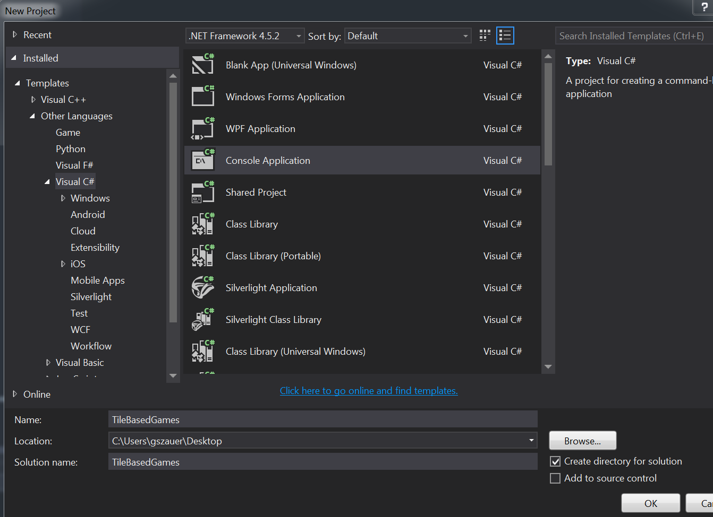

Notice that this created a new solution called TileBasedGames as well as a new project called TileBasedGames. Go ahead and delete the project. Right click the project and select Remove. Click "OK" on the confirm dialog.

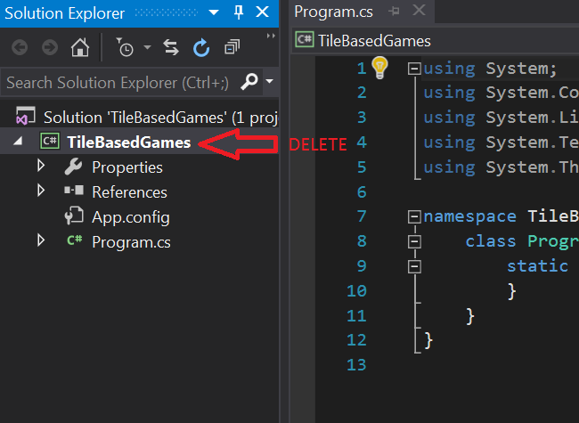

If you look at the "TileBasedGames" folder there are two things in there, a solution named "TileBasedGames" and a folder named "TileBasedGames". The folder contains the project we just deleted. Go ahead and delete that folder.


Before we do anything else, add a .gitignore file. Use the [Visual Studio](https://github.com/github/gitignore/blob/master/VisualStudio.gitignore) template. 

Lets also add an Assets folder next to the solution. This is where we are going to keep all shared game assets. All in all your folder structre should look like this:

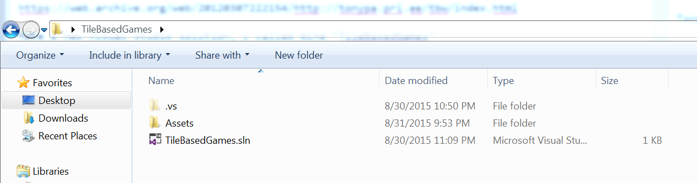

###Setting up a project
Let's go trough setting up a project together. While you won't use this specific project, all subsequent tutorials will have the same setup. Ideally you want to have one solution with many projects inside it.

Let's add a new project called **Skeleton**. Right click on your solution and add a new project.

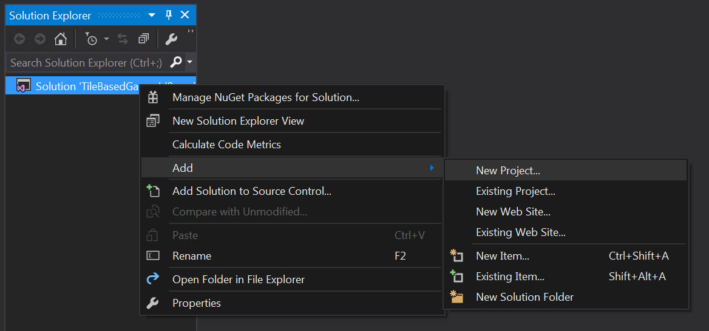

I'm going to go ahead and call mine **Skeleton**

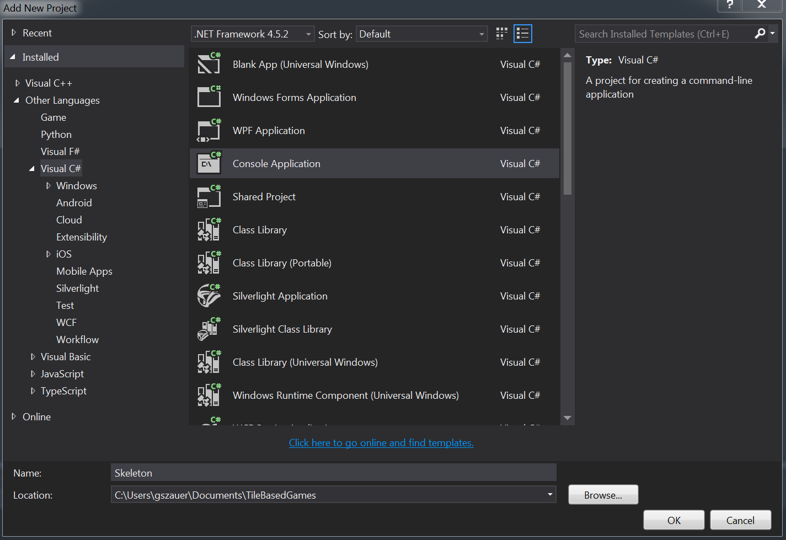

Link in System.Drawing. Right click on references and select "Add Reference"

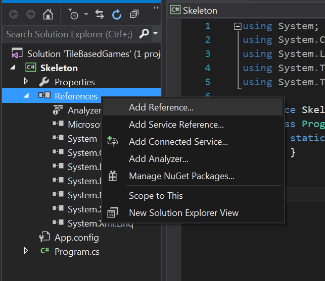

Type *System.Drawing* in the search box, check the appropriate package

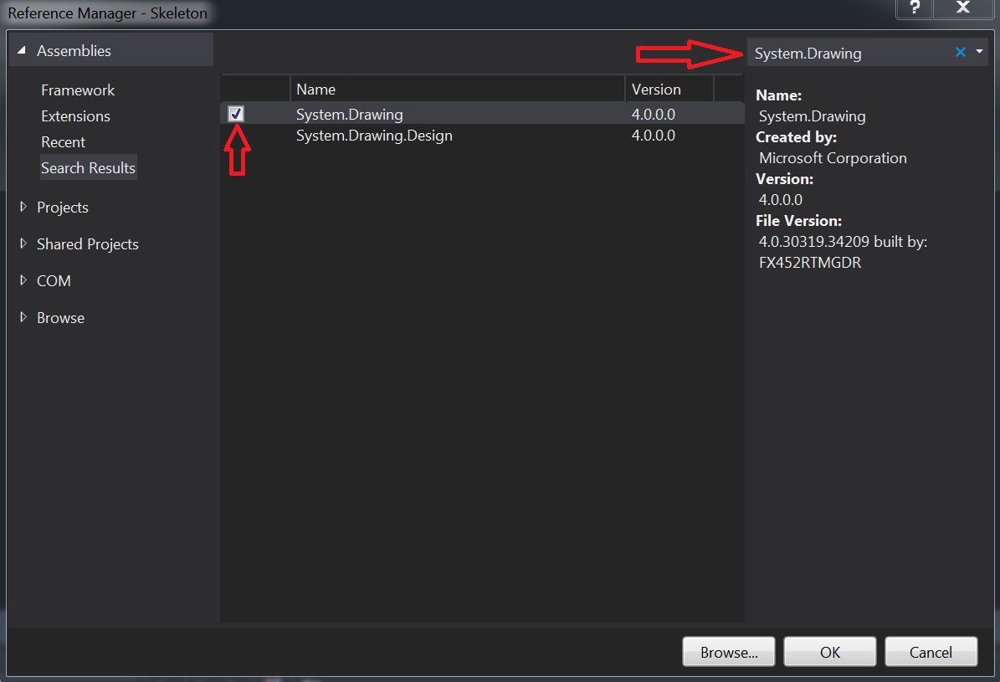

Next we're going to link in two NuGet packages, [OpenTK](http://www.opentk.com/) and (https://naudio.codeplex.com/). Right click on the project and select **Manage NuGet Packages**

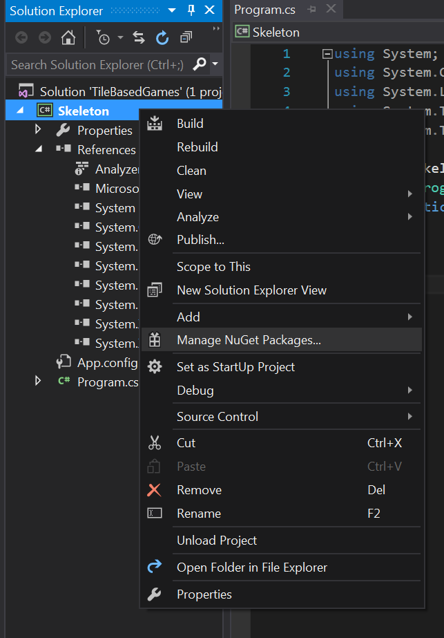

In the window that pops up, type **TopenTK** in the search bar, select the appropriate package and hit install.

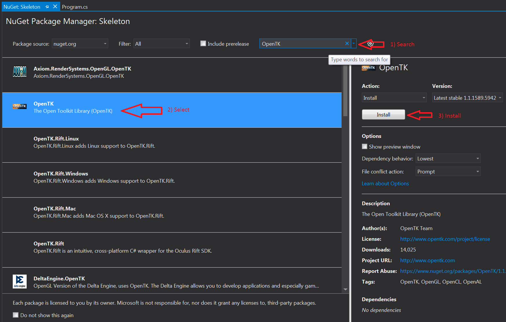

Repeat for NAudio


We set up an **Assets** folder when we created the soltuion. Let's set the projects working directory so we can actually use the Assets folder. Right click on the solution, select _Properties_

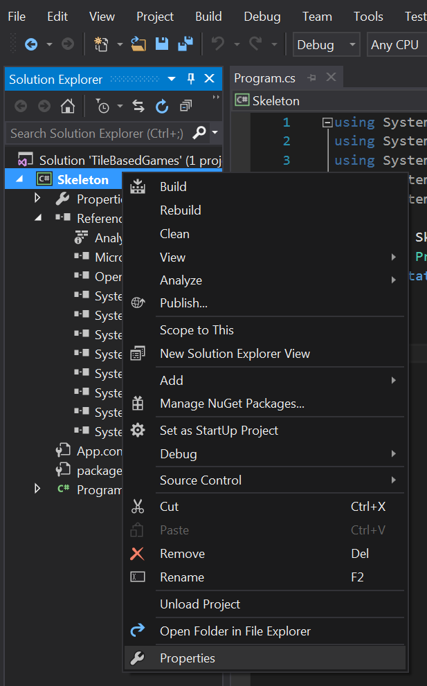

In the debug tab, browse for a new working directory

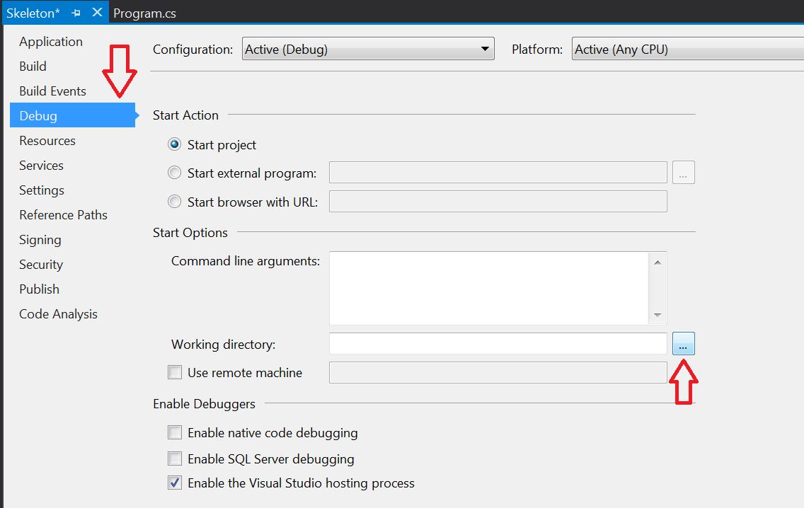

Select the **TileBasedGames** root directory. THIS IS NOT THE **Assets** DIRECTORY, RATHER THE Assets DIRECTORY'S PARENT. 

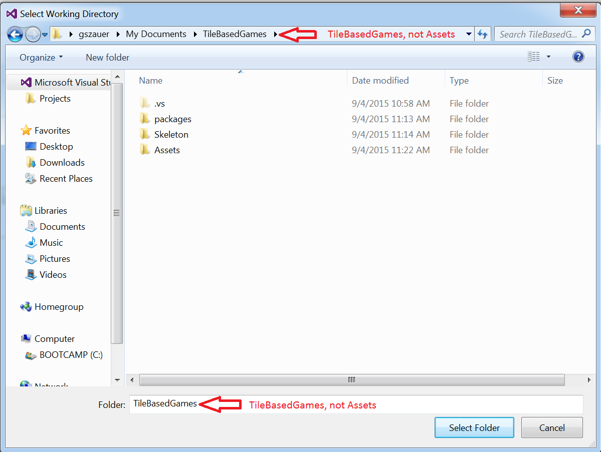

We want to select the parent of the Assets directory. This way when you are ready to distribute your game, you just have to copy the **Assets** directory next to your exe file. Your properties should look like this:

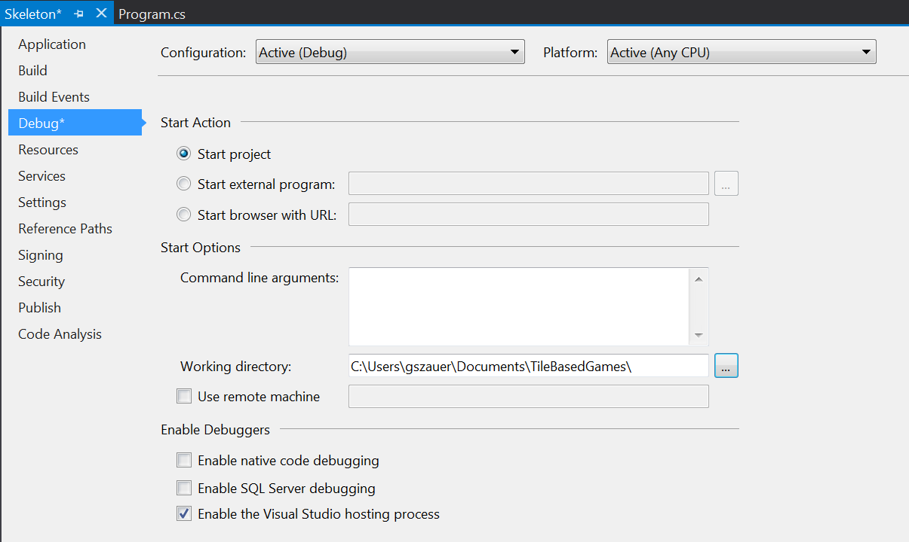

That is our basic project setup minus any code. **The Assets Directory Is Shared**. All of the projects we build in this tutorial will use the same **Assets** directory!

###Adding code
We're going to add the [OpenTK Framework Managers](https://github.com/gszauer/2DOpenTKFramework) to this project. I'll link to the code on the main repo, but i'll also include it in the tutorial, in case the repo goes down.

Right click on the project, select Add, then **New Folder**

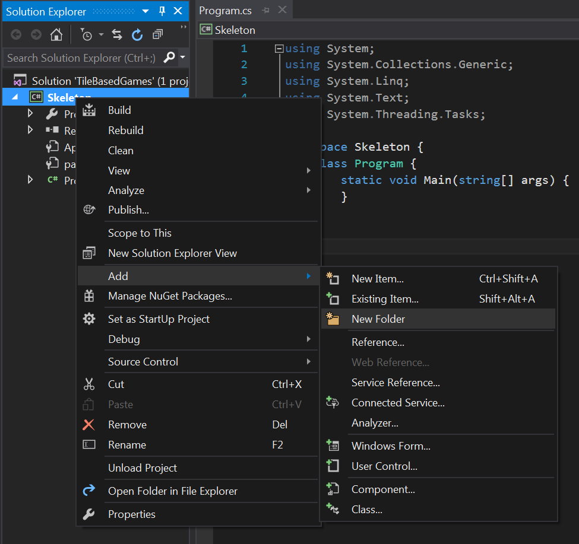

Go ahead and name this folder **Managers**. Right click on the new **Managers** folder, select add, then new item

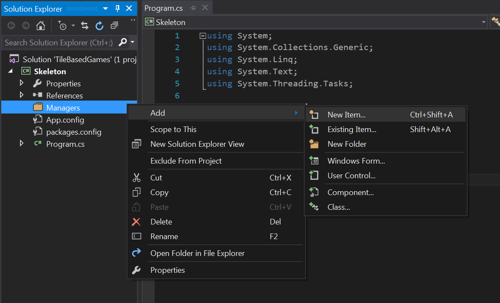

Call the new item **GraphicsManager**


Replace the contents of the new **GraphicsManager.cs** file [with this](https://github.com/gszauer/2DOpenTKFramework/blob/master/2DFramework/Framework/GraphicsManager.cs). Make sure to use the latest code from the repo, as some of the code might have changed since you last saw it.

Repeat the above steps to add the [TextureManager](https://github.com/gszauer/2DOpenTKFramework/blob/master/2DFramework/Framework/TextureManager.cs), [InputManager](https://github.com/gszauer/2DOpenTKFramework/blob/master/2DFramework/Framework/InputManager.cs) and [SoundManager](https://github.com/gszauer/2DOpenTKFramework/blob/master/2DFramework/Framework/SoundManager.cs). In case the main repo ever goes down i've included the source for all the managers in the tutorial, check the sub-sections of this section.

Let's add a new **Game** class, this is the class that we will be writing most of the example code in. Ideally you shouldn't have to touch any other classes. Add the game file to the solution (it's a top level file, next to Program.cs, not in the managers directory), and fill it with the following code:

```cs
using System;
using GameFramework;
using System.Collections.Generic;

namespace Skeleton {
    class Game {
        // Singleton
        private static Game instance = null;
        public static Game Instance {
            get {
                if (instance == null) {
                    instance = new Game();
                }
                return instance;
            }
        }

        protected Game() {

        }

        public void Initialize() {

        }

        public void Update(float dt) {

        }

        public void Render() {

        }

        public void Shutdown() {

        }
    }
}

```


#TODO
Creating tiles: Upload final zip!