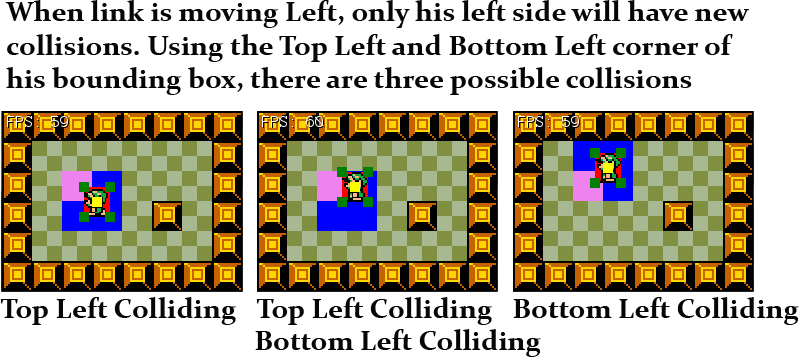

#Hit The Wall
Having a hero who can walk is fun, but it would be even more fun if the hero could hit the brick wall... With his face! Handling collisions with walls is not that hard. We've done this in **WinFormGames** before. Given this situation:


We first want to find the rectangle for both link (outlined blue) and the obstacle (outlined green):


Using these two rectangles we want to see if they intersect. To do this we look for an intersection rectangle (outlined in red):


If the intersection(red) rectangle has an area greater than 0 (That is, if a collision has happened) we must resolve the collision. We do this by moving the character to the left, right up or down by the width or height of the intersection.

###Intersection
From the above description it becomes clear that we need to be able to get an intersection rectangle between two rectangles. We're going to add this ability to a common helper class. If this method is looking alien try to draw out all of the intersection cases on paper and follow it trough for each.

Let's make a new file, call it **Intersections.cs** and add the follwoing class to it:

```cs
using System.Drawing;

namespace HitTheWall {
    class Intersections {
        public static Rectangle Rect(Rectangle a, Rectangle b) {
            Rectangle result = new Rectangle(0,0,0,0);

            // Do they even intersect?
            if (a.Left < b.Right && a.Right > b.Left && a.Top < b.Bottom && a.Bottom > b.Top) {
                // They intersect, let's get the intersection

                result.X = System.Math.Max(a.Left, b.Left);
                result.Y = System.Math.Max(a.Top, b.Top);

                int right = System.Math.Min(a.Right, b.Right);
                int bottom = System.Math.Min(a.Bottom, b.Bottom);
                
                // Originally i assumed there might be an error in this function, because what if
                // right is less than result.X? After reviewing the above math on paper i realize
                // that these concerns where ungrounded, and that right will ALWAYS be greater!
                
                result.Width = right - result.X;
                result.Height = bottom - result.Y;
            }

            return result;
        }
        
    }
}
```

If you end up drawing and labeling these, remember X / Y is the same as Top / Left. But Width / Height are different from Bottom / Right:


###Character Refactor
We're going to need to know some information about the character that we don't already know. Nameley we will need to know the center point of the character, and the bounding rectangle of the character. Remember, these can be different for every frame. 

We're going to add some getters for the missing information, remember this is going in the ```Character``` class, not _PlayerCharacter_. You should have enough information to figure these attributes out. Implement these getters:

```cs
public PointF Center {
    get {
        // TODO
    }
}

public Rectangle Rect {
    get {
        // TODO
    }
}
```

If you have any questions about the implementation of these, don't hesitate to ask. While we're in the ```Character``` let's update the **Render** function with some debug code.

```cs
public void Render() {
    GraphicsManager.Instance.DrawRect(Rect, Color.Red);
    TextureManager.Instance.Draw(Sprite, new Point((int)Position.X,(int)Position.Y), 1.0f, SpriteSource[currentSprite][currentFrame]);
    Rectangle center = new Rectangle((int)Center.X - 5, (int)Center.Y - 5, 10, 10);
    GraphicsManager.Instance.DrawRect(center, Color.Yellow);
}
```

Adding the debug code should draw link with a red square the size of his bounding box behind him and with a yellow box at his sprites center:


Let's also change the characters position from a getter to a variable. Find this line in **Character.cs**

```cs
public PointF Position { get; set; }
```

And change it to

```cs
public PointF Position = new PointF(0.0f, 0.0f);
```

Now that Position is a variable and not a getter we can modify the X and Y properties of the value directly. Open up **PlayerCharacter.cs** 

Find and remove these two lines

```cs
PointF positionCpy = Position;
// ...
Position = positionCpy;
```

And replace every instance of ```positionCpy``` with ```Position```

We're going to change one last thing about the ```Character``` class. Back in **Character.cs** add the following code to the class

```cs
public PointF[] Corners {
    get {
        float w = SpriteSource[currentSprite][currentFrame].Width;
        float h = SpriteSource[currentSprite][currentFrame].Height;
        return new PointF[] {
            new PointF(Position.X, Position.Y),             // Top Left
            new PointF(Position.X + w, Position.Y),         // Top Right
            new PointF(Position.X, Position.Y + h),         // Bottom Left
            new PointF(Position.X + w, Position.Y + h)      // Bottom Right
        };
    }
}

public static readonly int CORNER_TOP_LEFT = 0;
public static readonly int CORNER_TOP_RIGHT = 1;
public static readonly int CORNER_BOTTOM_LEFT = 2;
public static readonly int CORNER_BOTTOM_RIGHT = 3;
```

The ```Corners``` accessor will return an array of 4 points. Each point is one of the corners of the player sprite. After that we have some named constants. These constants will allow us to access the ```Corners``` array by name isntead of having to remember hard coded numbers. Like so:

```cs
Rectangle topRight = heroChar.Corners[2]; // Flaky, we don't want to do this
Rectangle topLeft = heroChar.Corners[Hero.CORNER_TOP_LEFT]; // Sexy, ALWAYS DO THIS!
```

Let's visualize what this looks like. Change the ```Render``` function in **Character.cs** to:

```cs
public void Render() {
    GraphicsManager.Instance.DrawRect(Rect, Color.Red);
    TextureManager.Instance.Draw(Sprite, new Point((int)Position.X, (int)Position.Y), 1.0f, SpriteSource[currentSprite][currentFrame]);
    Rectangle center = new Rectangle((int)Center.X - 5, (int)Center.Y - 5, 10, 10);
    GraphicsManager.Instance.DrawRect(center, Color.Yellow);
    foreach(PointF corner in Corners) {
        Rectangle rect = new Rectangle((int)corner.X - 5, (int)corner.Y - 5, 10, 10);
        GraphicsManager.Instance.DrawRect(rect, Color.Green);
    }
}
```

Your code at this point should look like this:


###Resolving collisions
Nine times out of ten resolving collisions is going to go in the same function that handles input. (What's the case when this isn't how it happens? When solving continous integration systems in a Physics engine). In order to resolve collisions we need to know a few things. 

* Move the character
* Get a list of obstacles the character can hit.
* Check if character has hit obstacle
  * If so, undo the move action (clamp to obstacle)

Pretty simple. We basically move, check if the move is valid and undo the move if it's not.

If you are being clever and getting obstacles relative to theplayer, it's very important that you move the character first, then get the list of obstacles. This is because the list of obstacles will usually change based on the characters position. If the character moves you need the latest, most up to date obstacles. We're going to be clever and do this :)

The other option is to brute force the deal, this means checking and trying to resolve the characters collision against every collidable object all the time. This method might work for smaller games, but the list of collisions to check will quickly grow out of hand. Most of the time brute force will simply not be an option due to performance reasons. We will **not** be doing brute force.

###Game Refactor
Looking at the above list of how to resolve collisions we already know how to move the character. We however don't know how to get a list of obstacles that the character can collide with. This functionality is going to be given to **Game.cs**.

We're not going to call any new functions in Game. Instead we're going to add helper functions that will be called from inside of ```PlayerCharacter``` we can do this because ```Game``` is a singleton. We're going to write two helper functions ```GetTile``` and ```GetTileRect``` both of them are going to take a ```PointF``` as an argument.

How are these new functions going to be used? Inside of ```PlayerCharacter``` we're going to get the tile for one of the corners of the character. If the tile is NOT walkable, we're going to get it's rectangle (again, using one of the corner points). We will try to resolve collisions against this rectangle.

With that, add these functions to **Game.cs**

```cs
public Tile GetTile(PointF pixelPoint) {
    // TODO: Get the x and y indices of the tile from pixelPoint
    // Return the appropriate tile
    return null; // Just so this compiles
}

public Rectangle GetTileRect(PointF pixelPoint) {
    // TODO: Convert pixel point into a Rectangle that is on the tile grid
    // Hint, xTile * tileSize = Grid X Position
    // return the resulting rectangle
    return new Rectangle(); // Just so this compiles
}
```

Try to fill those functions in. Let's also change how the rendering of the game works by adding more debug symbols! Change the ```Render``` function in **Game.cs** to this:

```cs
public void Render() {
    for (int h = 0; h < map.Length; h++) {
        for (int w = 0; w < map[h].Length; w++) {
            map[h][w].Render();
        }
    }

    foreach (PointF corner in hero.Corners) {
        if (GetTile(corner).Walkable) {
            GraphicsManager.Instance.DrawRect(GetTileRect(corner), Color.Blue);
        }
        else {
            GraphicsManager.Instance.DrawRect(GetTileRect(corner), Color.Violet);
        }
    }

    hero.Render();
}
```

This render function actually demonstrates HOW we're going to use the ```GetTile``` and ```GetTileRect``` functions. Any tile that one of the player corners falls on is colored Blue or Violet. Blue tiles are walkable, Violet ones are not. When it comes time to Resolve Collisions, we only have to check the violet tiles. Checking so few tiles will make our game super performant. 

Running your game, you should get something like the below screenshot. The blue / violet squares might not always be evenly distributed. That is at some points you might only see 2 tiles get colored. Walk around, you should see a few patterns.


###Refactoring PlayerCharacter
Now comes the fun part. We're actually going to resolve collisions! **BUT FIRST**, lets do some house keeping! Let's make it so that the character can walk both up/down AND left/right at the same time. Inside **PLayerCharacter.cs** find and change:

```cs
else if (i.KeyDown(OpenTK.Input.Key.W) || i.KeyDown(OpenTK.Input.Key.Up)) {
```

to

```cs
if (i.KeyDown(OpenTK.Input.Key.W) || i.KeyDown(OpenTK.Input.Key.Up)) {
```

The way we do animations now is good, but an animation frame might change the Width / Height of our sprite. If the width or height is going to change, we want that to happen sooner, rather than later. Inside **PlayerCharacter.cs** we have a variable ```bool animating = false;``` Remove that.

Find the animation code at the bottom of ```Update``` and remove it. We're going to refactor it into an ```Animate``` function, this is what it's going to look like:

```cs
protected void Animate(float deltaTime) {
    animTimer += deltaTime;
    if (animTimer > animFPS) {
        currentFrame += 1;
        animTimer -= animFPS;
        if (currentFrame > SpriteSource[currentSprite].Length - 1) {
            currentFrame = 0;
        }
    }
}
```

Again, inside of the ```Update``` function replace everywhere aimation is set to true ```animating = true;``` to a call to Animate ```Animate(deltaTime```.

**Run the game** it should at this point run as expected. Now it's time to resolve some collisions! The key to efficient collision resolution is to check as few things as possible. As long as the character is the same size or smaller than the tiles there can be at most two collisions at a time:



When link is moving in one direction, only his corners in that direction need to be checked. And it's not even his corners, it's the tile his corners fall on. In the middle example above, both the top and bottom corners fall on the same tile, so only one is checked. Here is a breakdown of which corners to check:

* Moving Left
  * Check Top Left Corner
  * Check Bottom Left Corner
* Moving Right
  * Check Top Right Corner
  * Check Bottom Right Corner
* Moving Up
  * Check Top Left Corner
  * Check Top Right Corner
* Moving Down
  * Check Bottom Left Corner
  * Check Bottom Right Corner

How do we actually go about checking these? Let's walk trough adding collision resolution when moving left. First, locate the code that moves link left:

```cs
if (i.KeyDown(OpenTK.Input.Key.A) || i.KeyDown(OpenTK.Input.Key.Left)) {
    SetSprite("Left");
    Animate(deltaTime);
    positionCpy.X -= speed * deltaTime;
    
    // Add collision resolution
}
```

* To add collision resolution, first lets check the TopLeftCorner. 
* Use the Game class to get the tile at the top left corners Point
* Check to see if the tile is walkable. IF NOT:
  * Get the intersection rectangle of the player and the tile
  * An intersection happens if the intersection rect has an area > 0
  * Check if intersect.W * intersect.H > 0, IF IT IS:
    * Clamp player X to intersection rectangle right

Let's see what this would look like in code:

```cs
if (!Game.Instance.GetTile(Corners[CORNER_TOP_LEFT]).Walkable) {
    Rectangle intersection = Intersections.Rect(Rect, Game.Instance.GetTileRect(Corners[CORNER_TOP_LEFT]));
    if (intersection.Width * intersection.Height > 0) { // W * H == 0 if NO intersection happened!
        Position.X = intersection.Right;
    }
}
```

We don't need to fully qualify ```Rect```, ```Corner``` or ```CORNER_TOP_LEFT``` because we inherited them from ```Character```. We can access the helper functions of ```Game``` trough it's singleton instance. 

That takes care of the top left collision of moving left, we need to also check bottom left. It's going to more or less be the same code. Here is the entire key checker part of the code:

```cs
if (i.KeyDown(OpenTK.Input.Key.A) || i.KeyDown(OpenTK.Input.Key.Left)) {
    SetSprite("Left");
    Animate(deltaTime);
    Position.X -= speed * deltaTime;

    if (!Game.Instance.GetTile(Corners[CORNER_TOP_LEFT]).Walkable) {
        Rectangle intersection = Intersections.Rect(Rect, Game.Instance.GetTileRect(Corners[CORNER_TOP_LEFT]));
        if (intersection.Width * intersection.Height > 0) { // W * H == 0 if NO intersection happened!
            Position.X = intersection.Right;
        }
    }

    if (!Game.Instance.GetTile(Corners[CORNER_BOTTOM_LEFT]).Walkable) {
        Rectangle intersection = Intersections.Rect(Rect, Game.Instance.GetTileRect(Corners[CORNER_BOTTOM_LEFT]));
        if (intersection.Width * intersection.Height > 0) { // W * H == 0 if NO intersection happened!
            Position.X = intersection.Right;
        }
    }
}
```

**Run the game**, walking to the left collisions should now happen. But you can walk trough tiles in any other direction. Go ahead and add collision resolution code to the rest of the movement directions. Keep in mind:

* Do walking Up after the Left sample. Up is easyer than Right
* When handling Right & Down, keep in mind that the players position 0,0 is top right
  * You will have to subtract player width or height from the clamp position