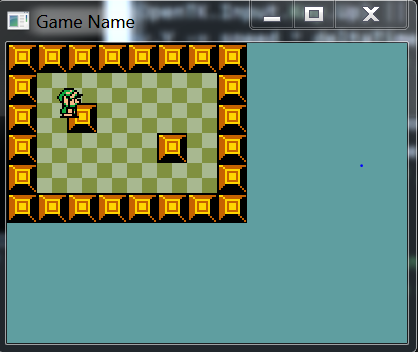

#Hit The Wall
Having a hero who can walk is fun, but it would be even more fun if the hero could hit the brick wall... With his face! Handling collisions with walls is not that hard. We've done this in **WinFormGames** before. Given this situation:



We first want to find the rectangle for both link (outlined blue) and the obstacle (outlined green):


Using these two rectangles we want to see if they intersect. To do this we look for an intersection rectangle (outlined in red):


If the intersection(red) rectangle has an area greater than 0 (That is, if a collision has happened) we must resolve the collision. We do this by moving the character to the left, right up or down by the width or height of the intersection.

###Intersection
From the above description it becomes clear that we need to be able to get an intersection rectangle between two rectangles. We're going to add this ability to a common helper class. If this method is looking alien try to draw out all of the intersection cases on paper and follow it trough for each.

Let's make a new file, call it **Intersections.cs** and add the follwoing class to it:

```cs
using System.Drawing;

namespace HitTheWall {
    class Intersections {
        public static Rectangle Rect(Rectangle a, Rectangle b) {
            Rectangle result = new Rectangle(0,0,0,0);

            // Do they even intersect?
            if (a.Left < b.Right && a.Right > b.Left && a.Top < b.Bottom && a.Bottom > b.Top) {
                // They intersect, let's get the intersection

                result.X = System.Math.Max(a.Left, b.Left);
                result.Y = System.Math.Max(a.Top, b.Top);

                int right = System.Math.Min(a.Right, b.Right);
                int bottom = System.Math.Min(a.Bottom, b.Bottom);

                result.Width = right - result.X;
                result.Height = bottom - result.Y;
            }

            return result;
        }
        
    }
}
```

If you end up drawing and labeling these, remember X / Y is the same as Top / Left. But Width / Height are different from Bottom / Right:


###Character Refactor
We're going to need to know some information about the character that we don't already know. Nameley we will need to know the center point of the character, and the bounding rectangle of the character. Remember, these can be different for every frame. 

We're going to add some getters for the missing information, remember this is going in the ```Character``` class, not _PlayerCharacter_. You should have enough information to figure these attributes out. Implement these getters:

```cs
public PointF Center {
    get {
        // TODO
    }
}

public Rectangle Rect {
    get {
        // TODO
    }
}
```

If you have any questions about the implementation of these, don't hesitate to ask. While we're in the ```Character``` let's update the **Render** function with some debug code.

```cs
public void Render() {
    GraphicsManager.Instance.DrawRect(Rect, Color.Red);
    TextureManager.Instance.Draw(Sprite, new Point((int)Position.X,(int)Position.Y), 1.0f, SpriteSource[currentSprite][currentFrame]);
    Rectangle center = new Rectangle((int)Center.X - 5, (int)Center.Y - 5, 10, 10);
    GraphicsManager.Instance.DrawRect(center, Color.Yellow);
}
```

Adding the debug code should draw link with a red square the size of his bounding box behind him and with a yellow box at his sprites center:


###Resolving collisions
Nine times out of ten resolving collisions is going to go in the same function that handles input. (What's the case when this isn't how it happens? When solving continous integration systems in a Physics engine). In order to resolve collisions we need to know a few things. 

* Get a list of obstacles the character can hit.
* Move the character
* Check if character has hit obstacle
  * If so, undo the move action (clamp to obstacle)

Pretty simple. We basically move, check if the move is valid and undo the move if it's not.

###PlayerCharacter Refactor
Before getting any of the obstacles or anything, let's update the ```PayerCharacter``` class. To keep thinks loosley coupled, the player character will not know about ```Game```. Instead we're going to add obstacles as an argument to input. This keeps all movement code local to ```PlayerCharacter```. Find this line:

```cs
public void Update(float deltaTime) {
```

and change it to this

```cs
public void Update(float deltaTime, Rectangle[] obstacles) {
```

###A better way
Some of this code might seem a bit convoluted, expecially because we move link horizontally, resolve collisions, then move him vertically. It's a bit of a mess. But it's not a bad way to handle the situation. All mission critical code is local to the ```PlayerCharacter``` class. 

If it makes more sense to you, adding the player movement and collision resolution code directly into the ```Game``` class is also a valid option. It will bloat the size of the **Game.cs** file, but the update will be easyer to read. Something like this:

```
// PSEUDO CODE, NOT PRODUCTION!

void Game.Update(float dt) {
    InputManager.Update();
    
    // Update the hero
    if (GetKey(Keys.Right)) {
        hero.Animate(dt);
        
        hero.Position.X += speed * dt;
        if (IsCollidingWithMap(hero)) {
            hero.Position.X -= GetCollisionWidth(hero, GetCollisionTile(hero));
        }
    }
    else if (GetKey(Keys.Left)) {
        hero.Animate(dt);
        
        hero.Position.X -= speed * dt;
        if (IsCollidingWithMap(hero)) {
            hero.Position.X += GetCollisionWidth(hero, GetCollisionTile(hero));
        }
    }
    
    // Do the same for Up and Down
    hero.SetAnimStateToDefault();
    
    // TODO: Update all enemies and other objects
}
```

You can see how this **DEEPLY** couples the ```PlayerCharacter``` and ```Game``` classes together. This deep coupling is why we didn't do it like this in the tutorial. But this does reinforce the above statement about the nature of moving objects:

* First,move the Object
* Next, check if there is a collision
  * If there was resolve the collision

Collisions are usually resolved by moving the character back by some intersection amount.

Anyway, the way we did collision is one way. The way outlined in Pseudo Code above is another way. And there are many, many more ways of handling all of this. Once we get to 3D objects, we will see other ways of handling these situations.

For now spend some time thinking about how we are handling and resolving collisions. Are you happy with it? If you are we will move on. If you're not how would you make the situation better? Try to code it up, see if you can make your own version work!