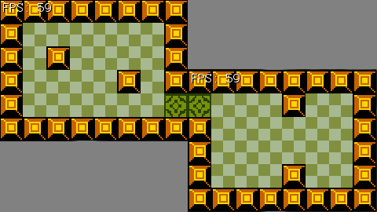
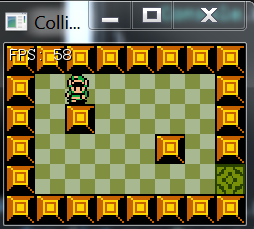
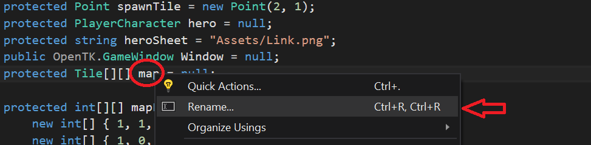
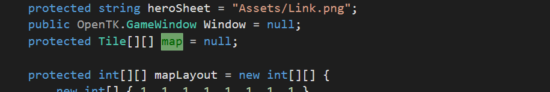

#Open The Door
In the last chapter we explored how to add collision to the walls of our room. This is aweome! But Link is feeling claustrophobic! He is an epic hero, confined to a tiny room... In this chapter we are going to double the size of Link's world by adding a second room to it! Here is the layout of what this is going to look like:



Of course only one of these rooms is going to be visible at a time, link's going to have to go trough the green door to visit the adjacent room. 

The nice thing here, none of the code for this is going to have to go inside the ```PlayerCharacter``` class, as none of this is specific to the player. Instead we're going to be writing most of our code inside of **Game.cs**

###New Project
Let's make a new project, call it **OpenTheDoor** and get this project up to par with the **HitTheWall** section of the writeup. We're going to work from here.

###The door tile
First thing is first, let's add our door tile that will lead into the second room. We're going to be working in **Game.cs**. Right now we define the map layout in the ```mapLayout``` variable where tile 1 is a wall and tile 0 is walkable. Let's add tile 2, which will be the door. 

* In the ```mapLayout``` varibale, change the appropriate tile to be a door
  * Look at the above screnshot, it's the tile in the lower right
* Add ```new Rectangle(32, 187, 30, 30)``` to the ```spriteSources``` array
* Make tile 2 walkable. So tiles 0 and 2 should both be walkable.

Be careful when walking around! While you should be able to walk a little bit into the door, if you walk too far into the new door tile the game will crash. This is expected. After the above changes, running the game should look like this:



###The second room
Sweet we now have a door (well, visually at least), but it doesn't lead anywhere! We're going to add a second map. Still in **Game.cs**, refactor the name of the ```map``` variable to be ```room1```. To do this, right click on ```map``` and select **Rename**



This will cause the ```map``` variable to highlight in some strange green color, just start typing and the name of the variable will change. When you are done, hit enter and all instances of ```map``` will be autmatically renamed for you.



Now rename the ```mapLayout``` variable to be named ```room1Layout```. 

**Run The Game** at this point it's important for you to run the game and make sure it still works correctly!

Next, let's add the definition of ```room2``` and ```room2Layout```. Seeing how this is mostly a copy / paste job of ```room1``` with minor alterations, use this clode:

```
protected Tile[][] room2 = null;

protected int[][] room2Layout = new int[][] {
    new int[] { 1, 1, 1, 1, 1, 1, 1, 1 },
    new int[] { 2, 0, 0, 0, 1, 0, 0, 1 },
    new int[] { 1, 0, 0, 0, 0, 0, 0, 1 },
    new int[] { 1, 0, 0, 0, 0, 0, 0, 1 },
    new int[] { 1, 0, 0, 0, 1, 0, 0, 1 },
    new int[] { 1, 1, 1, 1, 1, 1, 1, 1 }
};
```

Inside of the **Initialize** function, make sure that ```room2``` is created! Also, inside **Destroy** make sure that ```room2``` is unloaded.

###The current room
At this point we have two rooms, but they are kind of useless. This is because every function is hard-coded to work with room1. Let's fix that by introducing a ```currentRoom``` variable! Start off by adding these two member variables:

```
protected Tile[][] currentRoom = null;
protected int[][] currentLayout = null;
```

At the end of the initialize function point the ```currentRoom``` and ```currentLayout``` references at room2, like so:

```
currentRoom = room2;
currentLayout = room2Layout;
```

Of course running the game, link still starts out in ```room1```. this is because nothing is using the ```currentRoom``` variable yet. Update the following to use ```currentRoom``` instead of ```room1```:

* GetTile function
* Render function

**Running the game**, link should now be in room2. Make sure the collisions are correct.

###Walking trough the door
The last thing left to do is to add the logic to walk link trough that door. And this is going to be pretty simple. In the ```Update``` method of **Game.cs**, we're going to check if the player rectangle intersects with any door rectangles. If it does, based on the door number we will set currentRoom to the appropriate room. Finally, we will set the position of the player to look like he's walked trough the door.

One thing you might have noticed about the above logic, if we transport the player as soon as he touches the door, it might not look natural. It definateley won't look like link is walking trough the door... More like he accidentally touched a magic portal. Because of this, instead of checking links bounding box, we're going to construct a 10PX rectangle at his center. And we will test this against intersecting with the door.

I originally wanted to make this an "On Your Own" exercise, but the code is pretty straight forward, and it's hard to give instructions on it. So, read the below code carefully, and let me know if you have any questions.

```cs
public void Update(float dt) {
    hero.Update(dt);
    
    // We need to check for doors AFTER the player has moved
    
    // Loop torugh the layout, the Tile class does not know if it is a door or not.
    for (int row = 0; row < currentLayout.Length; ++row) {
        for (int col = 0; col < currentLayout[row].Length; ++col) {
        
            // Tile 2 is a door.
            if (intersection.Width * intersection.Height > 0) {
                // If we are in room1, move to room 2
                if (currentRoom == room1) {
                    // Set active room
                    currentRoom = room2;
                    currentLayout = room2Layout;

                    // Reposition hero to tile outside of door
                    hero.Position.X = 1 * 30; // Column 1
                    hero.Position.Y = 1 * 30; // Row 1
                }
                // If we are in room 2, move to room 1
                else {
                    // Set active room
                    currentRoom = room1;
                    currentLayout = room1Layout;

                    // Reposition hero to tile outside of door
                    hero.Position.X = 6 * 30; // Column 6
                    hero.Position.Y = 4 * 30; // Row 4
                }
            }
        }
    }
}
```

You might be thinking to yourself, we could make things easyer by storing a bolean in the ```Tile``` class, then we wouldn't need to loop trough the tileLayout array.... And you are correct! In fact, that's what the next section is all about. Read on!

#Cleaning Up
Follow along to the code in the **Cleaning** Up subsection inside of this (OpenTheDoor) project. The **Cleaning Up** section just gives us an easy way to store room's as objects, instead of cluttering up the **Game.cs** file.