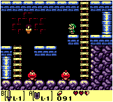

#Jumping
Tile games don't al have to be top down. We can change perspectives pretty easily. In this chapter we are going to do just that. Instead of the game playing top-down we're going to make it play from a side view. Mario style! The gameboy zelda games do include some side scrolling sections:

#Links
* http://excitemike.com/JumpingControlTester
* http://www.piratehearts.com/blog/2012/11/30/deriving-the-mathematics-of-jumping-physics-part-1-of/
* http://error454.com/2013/10/23/platformer-physics-101-and-the-3-fundamental-equations-of-platformers/
* http://higherorderfun.com/blog/2012/05/20/the-guide-to-implementing-2d-platformers/
* http://www.atomjack.net/blog/2014/12/9/dev-blog-designing-a-jump
* http://gamedev.stackexchange.com/questions/29617/how-to-make-a-character-jump#29618