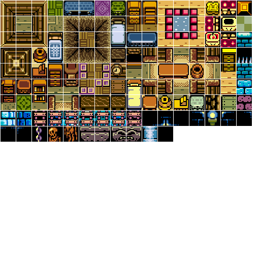

#Clouds
A cloud is a pretty simple construct in a platformer. You can walk trough a clouds left or right side. You can jump from below the clowd over it. So, there is no collision on it's bottom, left or right. However, you can land on a cloud. So it does have collision on the top. In this section, we're going to build a simple cloud. Things like breakable bricks or enemies in super mario are similar, they do one thing from one direction and another thing from another direction.

###New Project
Let's make a new project, call it **Clouds** and get this project up to par with the **Configurable Jumping** section of the writeup. We're going to work from here.

###Updated tile sheet
I've updated **HouseTiles.png** to be a new image. Right click on the below image, save as and overwrite your old one. This tile sheet is still shared between projects, i didn't touch any of the existing tiles, instead the sheet is now larger at 512x512 pixels.



###Updated rooms
In **Game.cs** replace the **SpriteSources** array with this revised version:

```cs
protected Rectangle[] spriteSources = new Rectangle[] {
    // OLD
    /* 0  */new Rectangle(466,32,30,30),
    /* 1  */new Rectangle(466,1,30,30),
    /* 2  */new Rectangle(32,187,30,30),
    // NEW
    /* 3  */new Rectangle(466, 125,30,30), // blue border
    /* 4  */new Rectangle(311, 249,30,30), // blackness
    /* 5  */new Rectangle(466, 63,30,30), // ground layer
    /* 6  */new Rectangle(63, 218,30,30), // blank ladder
    /* 7  */new Rectangle(156, 218,30,30), // ground ladder
    /* 8  */new Rectangle(63, 249,30,30),  // skele 1
    /* 9  */new Rectangle(94, 249,30,30), // slele 2
    /* 10 */new Rectangle(125, 249,30,30), // skele 3
    /* 11 */new Rectangle(156, 249,30,30), // cloud 1
    /* 12 */new Rectangle(187, 249,30,30), // cloud 2
};
```

Next update room 1 layout and room 2 layout

```cs
protected int[][] room1Layout = new int[][] {
    new int[] { 3, 3, 3, 3, 3, 3, 3, 3 },
    new int[] { 3, 4, 4, 4, 4, 4, 4, 3 },
    new int[] { 3, 4, 4, 4, 4, 4, 4, 3 },
    new int[] { 3, 4,11,12, 4, 4, 4, 3 },
    new int[] { 3, 4, 4, 4, 4, 4, 4, 2 },
    new int[] { 3, 5, 5, 5, 5, 5, 5, 5 }
};
protected int[][] room2Layout = new int[][] {
    new int[] { 3, 3, 3, 3, 3, 3, 3, 3 },
    new int[] { 3, 4, 4, 4, 4, 4, 8, 3 },
    new int[] { 3, 4, 4, 4, 4, 4, 9, 3 },
    new int[] { 3, 4, 4, 4, 4, 4,10, 3 },
    new int[] { 2, 4, 4, 4, 4, 4, 4, 3 },
    new int[] { 5, 5, 5, 5, 5, 5, 5, 3 }
};
```

Find where we make the rooms, and add 4, 8, 9 and 10 as walkable tiles:
```cs
room1 = new Map(room1Layout, spriteSheets, spriteSources, 2, 0, 4, 8, 9, 10);
room2 = new Map(room2Layout, spriteSheets, spriteSources, 0, 2, 4, 8, 9, 10);
```

The new rooms have adjacent doors. **On your own, update the door tiles**.

**Running the game**, you should see these two rooms:


You should be able to walk around without crashing. Confirm that you can walk from room 1 to room 2 and from room 2 from room one. You are ready to proceed when it works.