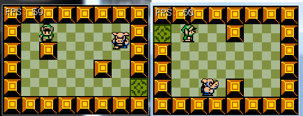

#Simple Enemy
Having a game where your hero is in an empty room is not much fun! Let's add some enemies to the game! For now they are going to be simple enemies, mario style. The enemy will spawn and start walking. It will walk until it hits a wall, then turn around. If at any point the enemy touches the player, the player dies. Just like mario.

###The Plan
How will this work? First off, we need to make an ```EnemyCharacter``` class. Games have multiple ```EnemyCharacter``` classes, one for each type of enemy. So for zelda you might have **MoblinEnemyCharacter**, **ChompChompEnemyCharacter**, **ChickenEnemyCharacter** and so on. We are only going to have one enemy class for now ```EnemyCharacter```. 

So, where do enemies go? Right now the ```Game``` owns the ```PlayerCharacter```. Can we just put an enemy array in ```Game```? Not really. Because our game has multiple rooms (or levels, whatever we are calling them), each room has it's own set of enemies. If you are in ```Room1``` then the enemies in ```Room2``` should not update or render! Therefore it makes sense to add a ```EnemyCharacter``` array inside of the ```Map``` class.

Now that map has a list of enemy characters it's going to need an update method. It needs this so the enemies can update themselves. It would also make sense to check for player collision in here! Instead of the player having to know about all the enemies, we just mape the map know about the player. Because map knows about the enemies and the player it's trivial to check for collision in there.

Finally, we need to add a game over state. This is going to be a simple bool in the ```Game``` class that controls what text we see on screen.

###New Project
Let's make a new project, call it **SimpleEnemy** and get this project up to par with the cleaned up version of the **OpenTheDoor** section of the writeup. We're going to work from here.

###Character refactor
Before creating the enemy class we need to refactor the ```Character``` and ```PlayerCharacter``` classes a bit. Right now all of the animation code is in ```PlayerCharacter``` seeing how both the player and the enemy will animate, we should move this functionality into the **Character** class.

The collision handling code is also all in ```PlayerCharacter```, and both player and enemy are going to collide with the wall, but for now we're going to duplicate the collision code across these two classes.

This refactor is super simple. Take the **Animate** method from ```PlayerCharacter``` and move it into ```Character```. Next take the **animFPS** and **animTimer** variables and also move them into ```Character```. That's it. The animation code is now shared for all characters!

**Run the game**, everything should work like before.

###Creating EnemyCharacter
The enemy characters are going to be simple. They are either going to move up or down. They are going to start walking and keep walking until they hit a wall. Once they hit a wall they are going to change direction. This is about as easy as you can get with an enemy, coincidentally most enemies in Super Mario work like this.

Add a new file, let's call it **EnemyCharacter.cs**, in it make the ```EnemyCharacter``` class a child class of ```Character``` (Just like PlayerCharacter is a subclass of Character). Add three variables to this new class:

* float **speed** = 60.0f;
  * Determines how fast an enemy walks. Measured in pixels per second. 
  * The player moves at 90, so the enemies are a little slower.
  * 60 pixels per second on a 30 pixel grid means enemies move 2 tiles / second
* bool **moveUpDown** = false;
  * If true, the enemy will move in an up and down direction
  * If false, the enemy will move in a left to right direction
* float **direction** = 1.0f;
  * Multiplies speed to determine which direction the enemy walks 
  * If positive the enemy will move down or right
  * If negative the enemy will move up or left
 
The **Constructor** for the enemy class is trivial, it does almost exactly what the Player constructor does. The only exception is the last argument that determines if the enemy is moving up/down or left/right. Also note, the sprite positions are different, i looked these values up using Paint.Net for you.

```cs
public EnemyCharacter(string spritePath, Point pos, bool movingUpDown) : base(spritePath, pos) {
    AddSprite("Down", new Rectangle(68, 112, 29, 30), new Rectangle(101, 112, 29, 30));
    AddSprite("Up", new Rectangle(134, 112, 30, 29), new Rectangle(167, 112, 30, 29));
    AddSprite("Left", new Rectangle(1, 113, 30, 30), new Rectangle(34, 112, 30, 30));
    AddSprite("Right", new Rectangle(201, 112, 30, 29), new Rectangle(234, 113, 30, 29));
    SetSprite("Down");

    moveUpDown = movingUpDown;
    if (!moveUpDown) {
        SetSprite("Right");
    }
}
```

The **Update** method for the enemy is very important. It animates the enemy, moves the enemys position and handles wall collisions. Let's write all of this in one go. I'm going to start you off with a template of the update function that animates and moves the enemy:

```cs
public void Update(float deltaTime) {
    Animate(deltaTime);

    if (moveUpDown) {
        // Direction is VERY important here. If it's positive the enemy moves up.
        // If its negative the player moves down. This happens because direction can
        // only be 1 or -1, so the code essentially translates to:
        // y += +(speed * delta) OR y += -(speed * delta)
        // depending on the value of direction. Nifty! 
        // The alternate to this is to add a bunch of bools (movingLeft, movingRight, etc...)
        // and flip them during collisions and add or subtract from y based on those bools
        // The bool approach is obviously aweful! Just multiplying a positive or -1 is very elegant.
        // Remember this trick, it's going to save you so many if statements down the line.
        Position.Y += direction * speed * deltaTime;
        
        // TODO: Handle wall collision (4 possible collisions)
    }
    else {
        Position.X += direction * speed * deltaTime;
        // TODO: Handle wall collision (4 possible collisions)
    }
}
```

This enemy is taking shape niceley! If we where to add him to the game right now it would just start walking in a direction and never stop. All we have to do is add wall collision and we are done with the enemy class. Lickly we have a template for collision code! We wrote all collision cases for the player class, all we have to do is copy them over and modify them slightly. I'll get you started with an example. Let's look at what the player character does when the up button is pressed:

```cs
if (i.KeyDown(OpenTK.Input.Key.W) || i.KeyDown(OpenTK.Input.Key.Up)) {
    SetSprite("Up");
    Animate(deltaTime);
    Position.Y -= speed * deltaTime;
    if (!Game.Instance.GetTile(Corners[CORNER_TOP_LEFT]).Walkable) {
        Rectangle intersection = Intersections.Rect(Rect, Game.Instance.GetTileRect(Corners[CORNER_TOP_LEFT]));
        if (intersection.Width * intersection.Height > 0) {
            Position.Y = intersection.Bottom;
        }
    }
    if (!Game.Instance.GetTile(Corners[CORNER_TOP_RIGHT]).Walkable) {
        Rectangle intersection = Intersections.Rect(Rect, Game.Instance.GetTileRect(Corners[CORNER_TOP_RIGHT]));
        if (intersection.Width * intersection.Height > 0) {
            Position.Y = intersection.Bottom;
        }
    }
}
```

This is more than what we need. We don't care about keyboard input, and we already took care of moving. All we really need out of that top blob is the collision code, like so:

```cs
if (!Game.Instance.GetTile(Corners[CORNER_TOP_LEFT]).Walkable) {
    Rectangle intersection = Intersections.Rect(Rect, Game.Instance.GetTileRect(Corners[CORNER_TOP_LEFT]));
    if (intersection.Width * intersection.Height > 0) {
        Position.Y = intersection.Bottom;
    }
}
if (!Game.Instance.GetTile(Corners[CORNER_TOP_RIGHT]).Walkable) {
    Rectangle intersection = Intersections.Rect(Rect, Game.Instance.GetTileRect(Corners[CORNER_TOP_RIGHT]));
    if (intersection.Width * intersection.Height > 0) {
        Position.Y = intersection.Bottom;
    }
}
```

This is checking for the TOP collision. Meaning if the enemy is walking upwards he will hit the wall and not do anything, just keep walking into the wall. But hey at least there is collision and he won't walk off the screen! Let's add code in there to flip the enemy direction:

```cs
if (!Game.Instance.GetTile(Corners[CORNER_TOP_LEFT]).Walkable) {
    Rectangle intersection = Intersections.Rect(Rect, Game.Instance.GetTileRect(Corners[CORNER_TOP_LEFT]));
    if (intersection.Width * intersection.Height > 0) {
        Position.Y = intersection.Bottom;
        direction = 1.0f;
        SetSprite("Down");
    }
}
if (!Game.Instance.GetTile(Corners[CORNER_TOP_RIGHT]).Walkable) {
    Rectangle intersection = Intersections.Rect(Rect, Game.Instance.GetTileRect(Corners[CORNER_TOP_RIGHT]));
    if (intersection.Width * intersection.Height > 0) {
        Position.Y = intersection.Bottom;
        direction = 1.0f;
        SetSprite("Down");
    }
}
```

Our update method should look like this now:

```cs
public void Update(float deltaTime) {
    Animate(deltaTime);

    if (moveUpDown) {
        // Direction is VERY important here. If it's positive the enemy moves up.
        // If its negative the player moves down. This happens because direction can
        // only be 1 or -1, so the code essentially translates to:
        // y += +(speed * delta) OR y += -(speed * delta)
        // depending on the value of direction. Nifty! 
        // The alternate to this is to add a bunch of bools (movingLeft, movingRight, etc...)
        // and flip them during collisions and add or subtract from y based on those bools
        // The bool approach is obviously aweful! Just multiplying a positive or -1 is very elegant.
        // Remember this trick, it's going to save you so many if statements down the line.
        Position.Y += direction * speed * deltaTime;
        
        if (!Game.Instance.GetTile(Corners[CORNER_TOP_LEFT]).Walkable) {
            Rectangle intersection = Intersections.Rect(Rect, Game.Instance.GetTileRect(Corners[CORNER_TOP_LEFT]));
            if (intersection.Width * intersection.Height > 0) {
                Position.Y = intersection.Bottom;
                direction = 1.0f;
                SetSprite("Down");
            }
        }
        if (!Game.Instance.GetTile(Corners[CORNER_TOP_RIGHT]).Walkable) {
            Rectangle intersection = Intersections.Rect(Rect, Game.Instance.GetTileRect(Corners[CORNER_TOP_RIGHT]));
            if (intersection.Width * intersection.Height > 0) {
                Position.Y = intersection.Bottom;
                direction = 1.0f;
                SetSprite("Down");
            }
        }
        // TODO: Bottom collision (2 if statements)
    }
    else {
        Position.X += direction * speed * deltaTime;
        // TODO: Left collision (2 if statements)
        // TODO: Right collision (2 if statements)
    }
}
```

Go ahead and fill out the collision for the other directions of the enemy. Unfortunitaley we can't test our progress at this point as we havent added any enemies to the game yet. Lets go ahead and fix that!

###Refactoring Map
Inside of **Map.cs** add a new ```List``` of enemies to the ```Map``` class. We are going to use a list, not an array because we don't know in advance how many enemies a map will contain.

Let's add a new function to ```Map```, we're going to call this function ```AddEnemy``` all it's going to do is add a new enemy to the enemy list. It's as straight forward as things get. This will allow us to add enemies to a room even at runtime! So if the player trips a trap an enemy can spawn.

```cs
public void AddEnemy(string spritePath, Point pos, bool movingUpDown) {
    enemies.Add(new EnemyCharacter(spritePath, pos, movingUpDown));
}
```

Update the **Render** method of ```Map``` to loop trough all the enemies and call ```Render``` on them.

Update the **Destroy** method of ```Map``` to loop trough all the enemies and call ```Destroy``` on them.

Add a new **Update** method to ```Map```, it should take a ```float``` as an argument (```delatTime```). In the new ```Update``` method loop trough all the enemies and call ```Update``` on them.

That's it for now. This is the minimum ammount of code we need to add to support enemies. We will add player collision soon, but first let's get to a state where we can visually confirm that the enemies are working.

###Refactoring Game
We added a **Update** method to ```Map```. Make sure to call ```Udpate``` on the **currentRoom** in the ```Game`` class. Let's add a new constant to game:

```cs
protected string npsSheet = "Assets/NPC.png";
```

It's a good idea to make all commonly used strings, integers and other constants into variables. This way if you decide that ALL NPC characters should use "Assets/Baddies.png" later, you only have to change the path in one place instead of tracking down every occurance of the old string.

Now, inside of **Initialize**, let's add a couple of enemies:

```cs
room1.AddEnemy(npsSheet, new Point(6 * 30, 1 * 30), true);
room2.AddEnemy(npsSheet, new Point(1 * 30, 4 * 30), false);
```

That should to it. Run the game and you should see this:



They don't do much yet, but the enemies should walk until they hit a wall and then turn around.

###Loosing the game
Before adding collision to the player and enemy, let's add support for loosing the game to **Game.cs**. Add a new member variable, call it **GameOver** with a default state of false. This new variable should be public! Change the update method to respect this new variable.

In **Update**, if ```GameOver``` is true check to see if the space key was pressed. If the space key was pressed:

* Set game over to false
* Set currentMap to room1
* Set the hero position X to be at the spawn tile
* Set the hero position y to be at the spawn tile

else (if wame over was false) update the game like normal. Let's also update the Render method, if GameOver is true it should print a game over message over the existing screen. By not updating the game state, but still rendering it, we make it look like the game gets paused when there is a game over. It's a cool effect. Here is what the render should look like:

```cs
public void Render() {
    currentMap.Render();
    hero.Render();

    if (GameOver) {
        GraphicsManager.Instance.DrawRect(new Rectangle(0, 70, 240, 50), Color.CadetBlue);

        GraphicsManager.Instance.DrawString("Game Over", new PointF(70, 80), Color.Black);
        GraphicsManager.Instance.DrawString("Game Over", new PointF(69, 79), Color.White);

        GraphicsManager.Instance.DrawString("Press Space to play again", new PointF(5, 96), Color.Black);
        GraphicsManager.Instance.DrawString("Press Space to play again", new PointF(4, 95), Color.White);

    }
}
```

###Enemy collision
Working in **Map.cs**. Let's update the **Update** method of the ```Map``` class to check for collision against the player.

First, add a new argument to the Update method, it should be of type ```PlayerCharacter```.  Next, after updating the enemy check if it collides with the player. If it does use the ```Game``` singleton to set ```GameOver``` to true. 

How do we check if a player an an enemy collide? Both classes inherit the ```Rect``` getter from ```Character``` which returns their bounding rectangle. Check if the bounding rectangles intersection area is greater than 0. If it is, an intersection has happened.

```cs
public void Update(float dt, PlayerCharacter hero) {
    foreach (EnemyCharacter enemy in enemies) {
        enemy.Update(dt);

        Rectangle intersection = Intersections.Rect(enemy.Rect, hero.Rect);
        if (intersection.Width * intersection.Height > 0) {
            Game.Instance.GameOver = true;
        }
    }
}
```

Don't forget to add the exta argument to the function call in **Game.cs**. This is what my entire Update for Game looks like:

```cs
public void Update(float dt) {
    if (GameOver) {
        if (InputManager.Instance.KeyPressed(OpenTK.Input.Key.Space)) {
            GameOver = false;
            currentMap = room1;
            hero.Position.X = spawnTile.X * 30;
            hero.Position.Y = spawnTile.Y * 30;
        }
    }
    else {
        currentMap = currentMap.ResolveDoors(hero);
        currentMap.Update(dt, hero);
        hero.Update(dt);
    }
}
```

Run the game and walk into an enemy, you should see a game over message, and pressing space should let you start playing again!


Thats it! We now have support for simple enemies!