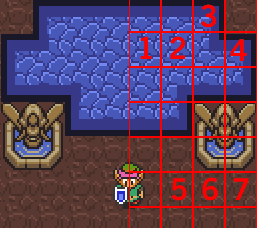

#Why Tiles

Before delving into how to make tile based games, why do we use tiles to being with? Are they easier to make than their free form counterparts? Do they run faster? Is C# even a good candidate to make tile based games?

Tile based games came about back in the olden days of computing. When processor speeds where counted in megahertz, not gigahertz. When memory was kilobytes not megabytes. The limitation of memory and processing power kept programmers from being able to display a 512 x 512 sprite while keeping framerates reasonable. 

Without being able to display large textures how can one draw a nice background? Slice the picture up into tiles! You don't need to waste memory on areas of the background that look the same.

In the picture you can see that parts of picture are exactly same. 1 is same as 2, 3 is same with 4 and parts 5-7 are all same thing. If you slice up the picture and reuse same parts in different areas, you have created the tiles. By only storing tiles we save both disk space and memory.

An unexpected side effect of using tiles is how easy they make it to update your game. If you are making a huge level and realize that you don't want to have the town in the lower left corner of the map, rather the upper right you can edit the tile map without having to edit any images. The dynamic nature of tiles makes developing games with tiles much faster, putting far less stress on the need of art support.

#C# And Tiles
With modern hardware we can render thousands if not millions of polygons and textures at the same time. There is no practical need for tiles when we could just render huge maps. So why use tiles at all? Aside from the ease of development tiles provide a distinct retro art style. Also, the concepts of tile based games will be useful for developing any type of game.

C# isn't a particularly bad or good fit for tiles. It supports multidimensional (jagged) arrays and the ability to draw sprites. That's really all you need to create tile based games. With that in mind, let's jump in and get started.