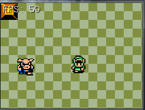

#Scrolling
So far out game has taken place inside of small rooms, we've discussed adding an overworld map where different screens are conneced trough hidden doors. This time let's make a proper overworld, one that scrolls!

Many RPG games like the early Final Fantasy or Fire Emblem games used overworld scrolling like this. Some early games like Super Mario also implemented scrolling.

There are two ways to approach scrolling. Move the world and shift the view. Lets take some time to talk about each method:

**Move The World**, like the name implies moves the entire world! In this method if you want to move the hero to the right you update the position of EVERYTHING, including the hero in the world to be moved the opposite direction of the hero (to the left), then move the hero to the right. 

Because everything shifted left, but only the hero shifted right you get the illusion tha the hero is in the center and the world scrolls around him. As you can imagine this method will quickly fall appart with LARGE (Over 1000 tiles) game worlds becuase the cost of updating everything grows with each object added.

**Shift the view**: This method calulates how much offset the player would need to appear in the center of the screen. When it comes time to render anything (beit the player a tile or an enemy) that difference is subtracted from the visual position.

Note, only the visual position is changed, the world position and update logic remain in tact. This method is preferable because it doesn't break anything we've done so far, it's strictly visual.

Needless to say **we are using the shift view method**, which coincidentally is how a 3D camera works (Just with a z-dimension added)

###Concept of a camera
This might be a bit confusing, but i'm going to try to explain the concept of a camera in a game. If it makes no sense, give me a call and we will talk about it. Don't worry, we're not making a camera class or anything, this is just to try to clear things up.

The way a camera works is kind of like in real life. We place a camera at a position in the world, then we see what the camera sees. The details of how this works are a bit more involved. In order to understand cameras we have to unserstand spaces.

**World Space**: World Space refers to all of the objects in their world position. For instance, when we put link at xPixel 90, yPixel 30, his world position is Point(90,30). Here is an image of all our game objects in world space:


**Camera Space**: Refered to as **View Space** if talking about 3D graphics, **Camera Space** if talking about 2D graphics. This is what your camera sees! Camera space is usually a subset of world space. Think of this as a shifted coordinate system. Think of it like this:

* Tile 0,1 is at position 0,1 in World Space
* The camera is located at positon 3, 2 in world space
* Relative to the camera, tile 0,1 is located at -3, -1
* Tile is located at -3,-1 in camera space

Why -3, -1? The camera has it's own reference point for where 0,0 is. This happens to be +3, +2 from world space. To go from world space to camera space, we must subtract the cameras world position -3, -2. From 0,1 if we take 3 away from the X and 2 away from the Y we are left with -3, -1.

That might sound complicated, but there is a simple formula to transform an object from world space to camera space:

```Object Position In Camera Space = Object Position in World Space - Camera Position In World Space```

This is what camera space for our game looks like (assuming a camera that is 8 tiles wide and 6 tiles tall):


The red square is camera space. Notice how the obstacle on the top left is at tile 5, 4 relative to the world, but at tile 0, 0 relative to the camera.... That's world space vs camera space! For us the camera is going to be centered around the character, it's position is tied to character position.

**Screen Space**, this is what actually appears on screen. Up until now we have seen the entire sceen! Really all **Screen Space** is just what you see on screen. For the most part we just want to see the bit of camera on screen. We want to chop off anything outside the camera view, and that's screen space. Here is a screenshot:



###Implementation
Let's go ahead and actually implement scrolling. This should be pretty simple, much less complex than the theory that goes behind it. 

The first thing to do is to **make the map bigger**. Go ahead and make room1 two, or maybe three times bigger. Running the game you will see that the screen resizes to fit your new room size. Go into the ```Initialization``` function of game and make the window size be only 8 by 6 tiles:

```cs
window.ClientSize = new Size(8 * tileSize, 6 * tileSize);
```

Cool, now you should be able to walk off screen. The rest of this section is rendering related. In **Game.cs** find your render function. The first thing we need to do is determine a world to camera space transformation. We want the camera's to be centered around link. That means we want it's upper left to be 120 pixels (4 * tileSize) to the left and 90 pixels (3 * tileSize) to the top. This will center link.

This world to camera transformation is going to be stored as a ```PointF```. I'm going to call mine ```offsetPosition```. Simply make a new ```PointF``` at the heros center and subtract half of the window width and height:

```cs
PointF offsetPosition = new PointF();
offsetPosition.X = hero.Position.X - (float)(4 * tileSize);
offsetPosition.Y = hero.Position.Y - (float)(3 * tileSize);
```

Now comes a bit of refactoring. Pass offsetPosition in to every render function that the **Game**'s render function calls. Next track down each of these functions, and add a ```PointF offsetPosition``` argument to them. Some functions call Render on other objects, Like the **Map** object calls **Render** on both EnemyCharacter and Tile. Add the argument to each of these as well. Every render function should take a PointF offsetPosition as an argument!

Inside each render function offset the X and Y positions of what is being rendered by the  offsetPosition being passed in (subtract the camera offset from the x and y of what would be rendered). For example, this is what the **Render** function of ```Character``` becomes.

```cs
public void Render(PointF offsetPosition) {
    // This is where we would render in world space
    Point renderPosition = new Point((int)Position.X, (int)Position.Y);
    
    // Apply the camera offset, bring us to rendering in camera space
    renderPosition.X -= (int)offsetPosition.X;
    renderPosition.Y -= (int)offsetPosition.Y;

    // Draw the character
    TextureManager.Instance.Draw(Sprite, renderPosition, 1.0f, SpriteSources[currentSprite][currentFrame]);
}
```

Go ahead