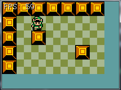

#Chapter 21 - More Scrolling

This is what my math looks like:
```cs
// If the hero is less than half the camera close to the left or top corner
if (hero.Center.X < 4 * tileSize) {
    offsetPosition.X = 0;
}
if (hero.Center.Y < 3 * tileSize) {
    offsetPosition.Y = 0;
}

// If the hero is less than half the camera close to the bottom or right corner
if (hero.Center.X > (currentMap[0].Length - 4) * tileSize) {
    offsetPosition.X = (currentMap[0].Length - 8) * tileSize;
}
if (hero.Center.Y > (currentMap.Length - 3) * tileSize) {
    offsetPosition.Y = (currentMap.Length - 6) * tileSize;
}
```

If you run the game there is going to be a visual error. When you are near the edge of the screen one or more of the tiles might be missing! Like this:



This happens because of **Map.cs**, it limits which tiles are rendered and which are hidden. But it only lets 4 tiles to the left or right. We basically need to double the ammount of visible tiles, this is because we can now walk to the edge of the screen. So find the bit of code that hadnles how much is visible, this code:

```cs
// Find the visible corners of the screen in pixel position
int minX = (int)cameraCenter.X - 4 * 30 - 30;
int minY = (int)cameraCenter.Y - 3 * 30 - 30;
int maxX = (int)cameraCenter.X + 4 * 30 + 30;
int maxY = (int)cameraCenter.Y + 3 * 30 + 30;
```

And bump p the visible area to be the entire screen, like so:

```cs
// Find the visible corners of the screen in pixel position
int minX = (int)cameraCenter.X - 8 * 30 - 30;
int minY = (int)cameraCenter.Y - 6 * 30 - 30;
int maxX = (int)cameraCenter.X + 8 * 30 + 30;
int maxY = (int)cameraCenter.Y + 6 * 30 + 30;
```