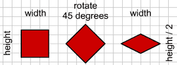

#Isometric View

Isometric worlds are great, they can add a lot of depth and visual appeal to a simple tile based game. Just look at Diablo 2, or Starcraft 1! 

There are some [great resources](http://gamedevelopment.tutsplus.com/tutorials/creating-isometric-worlds-a-primer-for-game-developers--gamedev-6511) online that really get into the nitty gritty of how isometric views work. They are worth a read.

Movement in an iso world doesn't have to be smooth. I think [This](http://www.gotoandplay.it/_articles/2007/03/isometric.php) demo fels awesome, and the character is snapped to a grid the whole time! Of course we are going to have smooth movement in our version.

Depth buffering is very important for an isometric scene. The draw order really, really matters! A Lot!

###New Project
Let's make a new project, call it **Isometric** and get this project up to par with the **DepthBuffer** section of the writeup. We're going to work from here.

###Tiles
So, how do we go from square tiles to isometric tiles? Simple, rotate by 45 degrees and scale height by 1/2 (0.5f). Like so:



Take note that even tough the height of the tile changes, the width is untouched. We _could_ do this in code, but we _should not_. Instead rely on artists to provide art assets! 

Speaking of art assets, i made a new tile sheet, we are going to use this sheet for isometric tutorials. Save it to your "Assets" folder, make sure to call it **isometric.png**.


The positioning of the tiles on the source image is very, very important! The origin of each tile must line up. Remember how in the depth section we have a few tiles that where taller than 30? This is the same concept. Take a look:


Notice how in the top, the registration point for both the flat and tall tiles are in the same spot? If we where to use a flat tile as the base of the tall tile, that's where the tip would be (On the y axis).

Same thing with player, we place him on top of the flat diamond, his registration point is where the tip of the tile would be (On the y axis).

Everything is set up relative to a base tile, in this case the base tile is just a flat outline. If you want to sprouce up the artwork you can follow some [tutorials](http://www.2dgameartguru.com/2012/02/building-isometric-art-in-vectors-step.html) to figure out how to make iso graphics... Or just [rip them](http://www.spriters-resource.com/pc_computer/diablo2diablo2lordofdestruction/) from a Diablo game

So, when rotating these tiles, what direction becomes which direction? The way i think about it is that we are doing a counter clockwise rotation. Like so (Each side is numbered):


###Coordinates
At the core of any isometric engine is being able to convert from cartesian coordinates to isometric coordinates. The top-down view we've been using up until now.

Atop down view grid is called cartesian coordinate system. The perspective view grid we are building is no longer using a cartesian coordinate system, it is going to be using an isometric one.

How to convert from **cartesian to isometric**?

* isoX = cartX - cartY;
* isoY = (cartX + cartY) / 2;

That's a nifty trick, how about going from **isometric to cartesian**?

* cartX = (2 * isoY + isoX) / 2;
* cartY = (2 * isoY - isoX) / 2;

Why do we need to convert both ways? I don't know if we _need_ to at this point yet. But we are going to keep doing updates in world space. Only the view is changine to cartesian, not the logic!

**GABOR TODO**: Explain math behind this!

###On Your Own
Add these functions to **Map.cs**

```cs
public static PointF CartToIso(PointF cartesian) {
    // TODO
}

public static PointF IsoToCart(PointF isometric) {
    // TODO 
}
```

###Changine the map
Let's start by refactoring the map to render in an isometric fasion! Let's start by editing **Game.cs**:

* Change the value of ```spriteSheets```
  * From: **"Assets/HouseTiles.png"**
  * To: **"Assets/isometric.png"**
* Change the value of ```spriteSources``` to
  * _/\*Index 0:\*/_ new Rectangle(120, 166, 138, 71),
  * _/\*Index 1:\*/_ new Rectangle(294, 147, 138, 90),
  * _/\*Index 2:\*/_ new Rectangle(120, 166, 138, 71)
* Change the value of ```room1Layout``` to
  * new int[] { 1, 1, 1, 1, 1, 1, 1, 1 },
  * new int[] { 1, 0, 0, 0, 0, 0, 0, 1 },
  * new int[] { 1, 0, 0, 0, 1, 0, 0, 1 },
  * new int[] { 1, 0, 1, 0, 0, 0, 0, 1 },
  * new int[] { 1, 0, 0, 0, 0, 0, 0, 2 },
  * new int[] { 1, 1, 1, 1, 1, 1, 1, 1 } 
* Change where room1 doctor is assigned:
  * From: ```room1[4][13].MakeDoor(room2, new Point(1, 1));```
  * To: ```room1[4][7].MakeDoor(room2, new Point(1, 1));```
* Change where room2 is assigned:
  * From: ```room2[1][0].MakeDoor(room1, new Point(12, 4));```  
  * To: ```room2[1][0].MakeDoor(room1, new Point(6, 4));```
* Hard code ```offsetPosition``` to 0,0 for now (We are not scrolling yet!)

Next we have a minor change to make in **Tile.cs**, remember how we hard coded the visual tile height to 30? Well we need to undo it. Find where in the ```Render``` code wecompare to and subtract 30 to give the illusion of depth, now change that to 138.