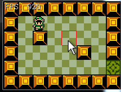

#Mouse To Move
Using the mouse to move will involve some rudimentary pathfinding / AI. We're going to implement the simplest path-finding possible. Usually, when doing a mouse to move you would use the A* algorithm to find the shortest path, however i have that lesson planned for later.

###New Project
Let's make a new project, call it **MouseToMove** and get this project up to par with the **OpenTheDoor** section of the writeup. We're going to work from here.

We don't care about items, enemies or bullets. We just want to be able to walk around with a mouse. And i'm hoping this means typing a little less boiler plate code.

###Tile Size
We are starting off from a state before we did the tile size refactor in the isometric section (obviously), but i don't like having 30 all over the place. I made a new ```public static readonly``` variable in **Game.cs** called ```TILE_SIZE``` and refactored the rest of the project to use this instead of the hard coded 30

You can keep hard coding 30, or do this refactor too, it's up to you. For the remainder of this article i'm going to be refering to the size of the tile by this new constant in **Game.cs**

###Mouse Indicator
Clicking on tiles is usually obvious enough, but having a mouse indicator is always a nice touch. We're going to figure out which tile the mouse is over and highlight it with a red outline.

In **Game.cs**, make a new ```Point``` variable, call it ```cursorTile```. In Update, we're going to set this. Set it to the tile that the mouse is on. Because our tiles are based on a grid of 30, if a mouse is at 45,67 it's tile would be 2,3.

In the render function, go ahead and draw a red rectangle around the selected tile. Remember to bring the tile from "tile space" back into "world space". We don't have a method to draw a square outline, you will have to do it with 4 lines. Here is what this should look like:

