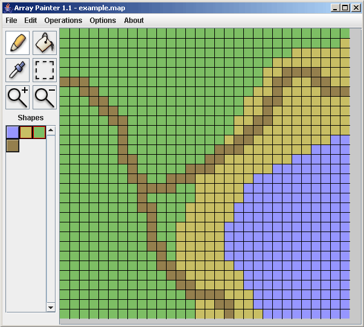
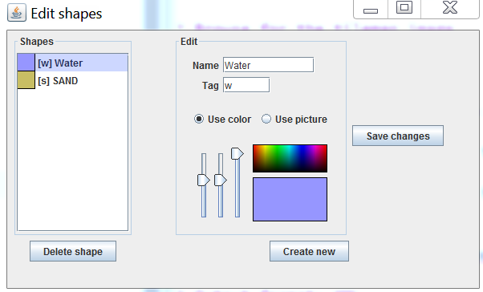
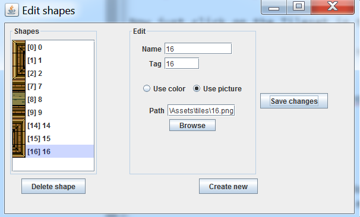
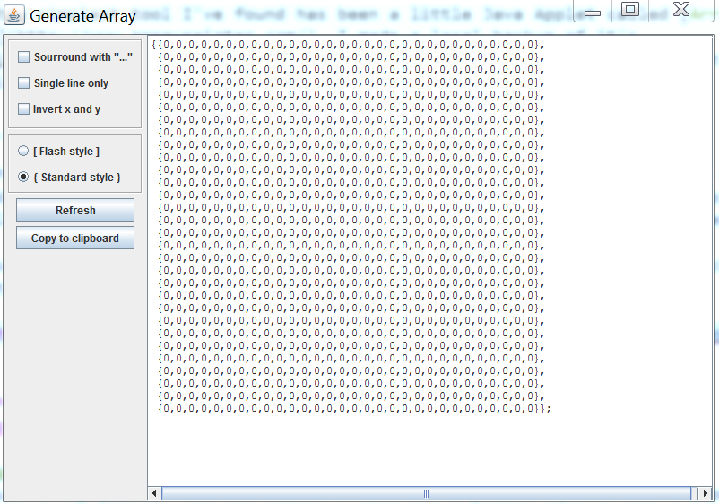

#Map Tools
As you can imagine, creating maps by hand becomes very tedious very fast! What we need is some tools to help us design these maps faster. Luckily, the internet is crawling with tools! 

A quick google for 2D Tile Editor will result in numerous searches. Each editor has it's own set of strengths and weaknesses, you can probably figure out how most of them work. 

Here, i want to go over two of what i think are the simplest / easyest tools to use to generate maps. These tools will not output our map format, but with a little bit of text editing we can transform their output into something useful.

###Online Tilemap Editor
The [Online Tilemap Editor](http://apps.elias.media/Online-Tile-Map-Editor/) is an HTML5 tile editor you can use right from your browser! Even more impressive, it's Open Source and on [Github](https://github.com/elias-schuett/Online-Tile-Map-Editor).

I like this editor because it's fast, easy and doesn't require any installation. It's a super quick editor to use, especially if you have a cleanly formatted map tiles, like our zelda map.

###Using Online Tilemap Editor

Go to the [Online Tilemap Editor](http://apps.elias.media/Online-Tile-Map-Editor/) website.

At this point the editor is generated with some default data.

Remove the tileset with the **Remove Tileset** button

Delete one of the layers by clicking the **gear icon** and selecting **Remove** from the dropdown menu.

Next click the **Add tileset** button, in the popup that follows:

* Browse for the tilemap image
* Tile Width is 30
* Tile Height is 30
* Tile Margin is 0
* Keep the Tile Alpha field blank

Now just click on the Tileset in the upper left and draw on stage in the right.

If you can't draw, make sure you have a layer selected. (Selected layer is blue)

###Exporting Data
Click **File > Export**, in the popup that follows select:

* Output format: XML
* Format output: yes
* Include src: no

Open up the output file that is downloaded with sublime text. You should be able to reformat this text into a C# array with fairly minimal effort.

###Array Painter
By far the simplest tool I've found has been a little Java Applet called [Array Painter](http://www.arraypainter.com/). I made a local backup of it's [JAR](Files/arraypainter.zip) file in case it ever goes offline. This is what the application looks like:

Go to the [applications website](http://www.arraypainter.com/), download the application. This download will give you a **jnlp** file, which is a shortcut to a Java Web App. (Want to know where the real app is? Open the jnlp file with sublimte text to see what it launches). 

There is a catch tough, windows has blocked jnlp applets by default. To launch the application, you must do the following once:

* Open the [Java Control Panel](https://www.java.com/en/download/help/win_controlpanel.xml)
* Click the **Security** tab
* Click the **Edit Site List** button
* Add the following URL to the list
  * http://www.arraypainter.com/webstart/webstart.jnlp

###Using Array Painter
By default array painter has two tiles. A blue and a yellow square. Let's import our own tiles. Go to **Options > Edit Shapes**. This brings up the "_Edit Shapes_" window:

Click the **Use picture** check mark and browse for an indevidual tile. Cut out tiles are located in the "_tiles_" folder under assets. Sadly, you can't import a full tile sheet. For the name and tag of the tile, just use it's number. These will be used later to export data. Click the **Create New** button.

Select the blue square, hit **Delete shape**, select the yellow square and hit **delete shape**. Next add all the tiles you want to use. This is what my window looks like:

Now you can close this window and paint in the main application. If you want to set the map size the option is under **Option > Set Map Size**.

###Exporting Data
When you have authored a map you like click **File > Generate Array**. You will be greeted with the following window:

Initially the text array is not populated inside the text box. Make sure you have the same things checked as i do (should be the default) and click the **Refresh** button. 

You should be able to copy this array and reformat it into a 2D C# array.

##A Better Tool?
All of the tools we've explored in this chapter are pretty nifty, but let's face it none of them are a slam dunk one stop solution for us. This is just the nature of tools, there is no such thing as really generic. If you feel like being a bad-ass you can write your own tool for editing maps. I for one would love to see a more up to date and useful version of Array Painter. It's a project i might actually take on one day.

Making a tile editor is not required, but if you feel up to it it's a fun little side project and a great review of using Windows Forms. 