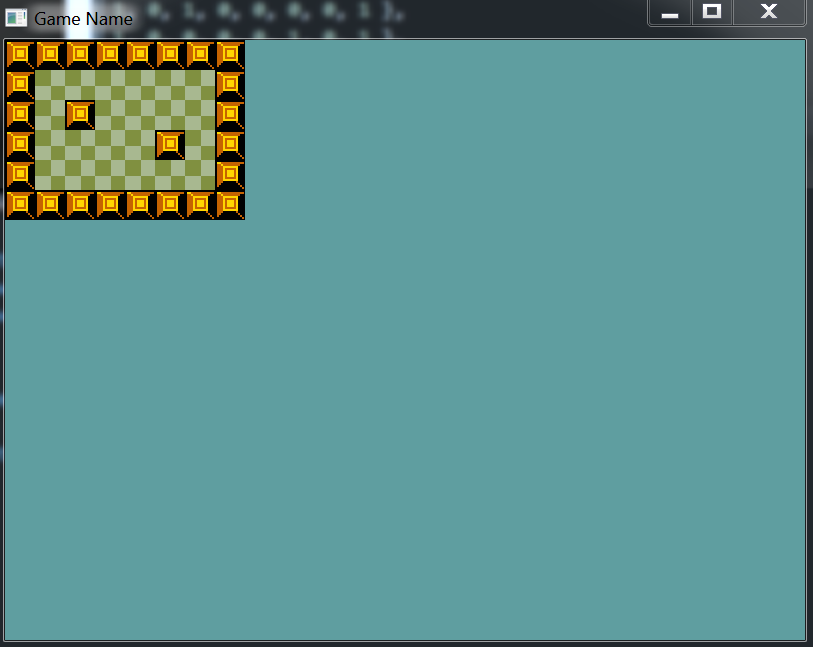
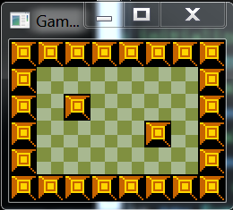

#Creating Tiles
The last section left off with an open ended question. What's more important clean code and messy data, or messy code and clean data? Seeing how we're making a game, not a tool i would say having clean code take priority. Games are complicated beasts, it's hard enough to make a game when you write good code, let's not over complicate the code needed for the sake of data.

###Getting the assets
I'm going to be using [this zelda tile set](https://dl.dropboxusercontent.com/u/48598159/ZeldaTiles.zip) for the tutorial. Download it, and unzip the textures into your "Assets" directory. All of the sprite sheets in that folder are already a power of two.

###New Project
Create a new project, call it "_Creating Tiles_" and make the standard window appear. Don't forget to set your working directory correctly. Follow this chapter along in this new solution.

###Tile Object
The first thing we need is a tile object. For now each object will have two properties, a sprite to display and a boolean to dictate if we can walk on it or not. In the future we will add properties to this tile definition as needed (eq: IsDestructable, IsHidden, etc...). The name of this class is going to simply be ```Tile```:

```cs
class Tile {
    public int Sprite { get; private set; }
    public Rectangle Source { get; private set; }
    public bool Walkable { get; set; }
    
    public Point WorldPosition { get; set; }
    public float Scale { get; set; }

    public Tile(string spritePath, Rectangle sourceRect) {
        Sprite = TextureManager.Instance.LoadTexture(spritePath);
        Source = sourceRect;
        Walkable = false;
        WorldPosition = new Point(0, 0);
        Scale = 1.0f;
    }

    public void Render() {
        Point renderPosition = new Point(WorldPosition.X, WorldPosition.Y);
        renderPosition.X = (int)(renderPosition.X * Scale);
        renderPosition.Y = (int)(renderPosition.Y * Scale);
        TextureManager.Instance.Draw(Sprite, renderPosition, Scale, Source);
    }

    public void Destroy() {
        TextureManager.Instance.UnloadTexture(Sprite);
    }
}
```

Lets see what the **Variables** do:

* Sprite - Once loaded, this is a reference to the sprite sheet we will be rendering
* Source - What section of the sprite sheet do we want to display
* Walkable - Can the player walk on this tile
* WorldPosition - What X / Y should the tile render a, this respects scale
* Scale - We might want to scale the tile to display on a larger screen
  * If we have a tile of size 16 at x position 2, it will draw at pixel 2 with a width of 16
  * The same (width 16, x 2) with a scale of 2 it will render at piel 4 with a width of 32

The **constructor** takes the path to a sprite sheet and a rectangle of the subsprite that represents this tile. It sets the appropriate member variables, and sets the rest to defaults.

Because the constructor called ```LoadTexture``` we must also call ```UnloadTexture```. The **Destroy** method serves this purpose. Once the Tile is no longer needed the Destroy function should be called.

The **Render** function is super simple, it just uses all the members we have to render the sprite. It's a simple wrapper for the ```Draw``` function of _TextureManager_. The only work render does is to account for scaling and world position.

###Map Data
So now that we have the definition of what an individual tile is, let's see if we can make a map. The ```map``` should be in a game class, you should be able to figure out how to add a game instance to the window.

```cs
class Game {
    protected Tile[][] map = null;
    protected int[][] mapLayout = new int[][] {
        new int[] { 1, 1, 1, 1, 1, 1, 1, 1 },
        new int[] { 1, 0, 0, 0, 0, 0, 0, 1 },
        new int[] { 1, 0, 1, 0, 0, 0, 0, 1 },
        new int[] { 1, 0, 0, 0, 0, 1, 0, 1 },
        new int[] { 1, 0, 0, 0, 0, 0, 0, 1 },
        new int[] { 1, 1, 1, 1, 1, 1, 1, 1 }
    };
}
```

* **map**: a 2D array to hold runtime map information
* **mapLayout**: Meta-data to hold an easily configurable map. 
  * 0's are walkable tiles
  * 1's are not walkable

As your game gets more and more complicated it may not be possible to store data in a simple representation like the one given above. I'm going to try my best to keep things as simple as possible for the tutorial. 

Now that we know what the map is going to look like, the next step is to actually load the map in! In order to create a tile object we need to know two things, the sprite sheet it's going to be on and the rectangle on that sheet. Before going any further, lets also add this meta-data to the game class

```cs
class Game {
    protected Tile[][] map = null;
    protected int[][] mapLayout = new int[][] {
        new int[] { 1, 1, 1, 1, 1, 1, 1, 1 },
        new int[] { 1, 0, 0, 0, 0, 0, 0, 1 },
        new int[] { 1, 0, 1, 0, 0, 0, 0, 1 },
        new int[] { 1, 0, 0, 0, 0, 1, 0, 1 },
        new int[] { 1, 0, 0, 0, 0, 0, 0, 1 },
        new int[] { 1, 1, 1, 1, 1, 1, 1, 1 }
    };
    
    protected string[] spriteSheets = new string[] {
        "Assets/HouseTiles.png",
        "Assets/HouseTiles.png"
    };
    protected Rectangle[] spriteSources = new Rectangle[] {
        new Rectangle(480,34,30,30),
        new Rectangle(480,1,30,30)
    };
}
```

Why did we add two arrays? Well, map layout refers to tiles by numbers, each number coresponds to an element in one of the new arrays we just created. Do we need the ```spriteSheets``` array? Not really. If we have a "world map" atlas that contains EVERY tile in the game, then the ```spriteSheets``` array is a lot of extra work. But what if we want tiles with a number **5** and above to come from an alternate sprite sheet? The ```spriteSheets``` array lets us do just that.

###Creating the Map
We now have all the information we need to build the map array. Some information like if a map is walkable or not is obvious, others like the X / Y location of a map we have to figure out. Let's create a helper function to create the map, and call said function in Initialize.

```cs
Tile[][] GenerateMap(int[][] layout, string[] sheets, Rectangle[] sources) {
    Tile[][] result = new Tile[layout.Length][];
    float scale = 1.0f;

    for (int i = 0; i < layout.Length; ++i) {
        result[i] = new Tile[layout[i].Length];

        for (int j = 0; j < layout[i].Length; ++j) {
            // The 0's and i's in the layout array correspond to
            // strings and rectangles in the sheets and sources arrays
            string sheet = sheets[layout[i][j]];
            Rectangle source = sources[layout[i][j]];
            
            // We don't have to take scale into account, but we do need
            // to space our grid out accordingly. It might be smart to have
            // a width and height that's a constant, right now we are assuming
            // that all of the passed in rect's in sources will have a uniform size
            Point worldPosition = new Point();
            worldPosition.X = (int)(j * source.Width);
            worldPosition.Y = (int)(i * source.Height);

            result[i][j] = new Tile(sheet, source);
            result[i][j].Walkable = layout[i][j] == 0;
            result[i][j].WorldPosition = worldPosition;
            result[i][j].Scale = scale;
        }
    }

    return result;
}

public void Initialize() {
    TextureManager.Instance.UseNearestFiltering = true;
    map = GenerateMap(mapLayout, spriteSheets, spriteSources);
}
```

With ```GenerateMap``` containing all of the logic for initializing tiles you can imagine that it's going to get more complicated as your tiles get more complicated. This is the expected behaviour, it's just something to keep in mind. 

Initialize calls a method of TextureManager we have not talked about yet:

```
TextureManager.Instance.UseNearestFiltering = true;
```

What does this do? Filtering is applied when an image is loaded. If filtering uses nearest, then everything resizes in a pixelated fashion. This is how you get pixel perfect images. If nearest filtering is NOT used then anti aliasing is applied to textures that are resized. This MAY cause blurry looking textures.

###Displaying the Map
With all of that in place, i think we are ready to render our tiles! Because the tile class has a ```Render``` method that takes care of it's own rendering, this is going to be super simple. Inside the **Game** classes ```Render``` function just call ```Render``` on every tile:

```cs
public void Render() {
    for (int h = 0; h < map.Length; ++h) {
        for (int w = 0; w < map[h].Length; ++w) {
            map[h][w].Render();
        }
    }
}
```

The game should now look like this:



###Cleanup
Don't forget, each tile loaded a sprite, we must now unload these!
```cs
public void Shutdown() {
    for (int h = 0; h < map.Length; ++h) {
        for (int w = 0; w < map[h].Length; ++w) {
            map[h][w].Destroy();
        }
    }
}
```

###Window size
If you want the tiles to fill out the full window, set the ClientSize of the window to **30 \* 8** by **30 \* 6**.

* 30 - width / height of sprite
* 8 / 6 - How many sprites we have horizontally (8) and vertically(6)

If our sprites had a scale factor to them, we would take that into account as well. Here is what the game looks like with the window size adjusted:

