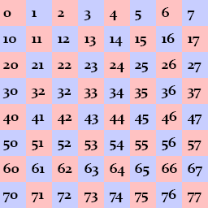

#Z-Buffer

The concept of a [Z buffer](https://en.wikipedia.org/wiki/Z-buffering) is pretty simple. Everything in the game has thre component coordinates: x, y and z. The game has two buffers, a color buffer and a depth buffer. When you try to draw something, the first thing that happens is the z value is written to the depth buffer. The depth buffer is a black and white image, low z values are black, high z values are white. 

So, the z value is written to the z buffer, the thing is, not every pixel might be written to the z buffer! If the object is partially occluded (if the buffer has lighter pixels over a part of the object), then those values are not written to the z buffer. This is called rejecting the pixel. It's also called a z test.

If a pixel fails the z test it is not written into the color buffer. If a pixel passes the z test, it is written into the color buffer.

This is the general concept of a z-buffer. It's a pretty important concept, if you are having trouble with it give me a call and we can talk it oer.

###New Project
Let's make a new project, call it **DepthBuffer** and get this project up to par with the **VisualTweaks** section of the writeup. We're going to work from here.

###Update Graphics Manager
GraphicsManager does not support all the functionality you need to get the project off the ground right now. You can fix this by grabing the latest manager [from my github](https://raw.githubusercontent.com/gszauer/2DOpenTKFramework/master/2DFramework/Framework/GraphicsManager.cs) and pasting it into your file.

###Existing Depth Buffer
The graphics frameworks is already using buffers under the hood. When you call ```GraphicsManager.Instance.ClearScreen(System.Drawing.Color.CadetBlue);``` in **Program.cs** the depth buffer is cleared to 0 (Pure white). 

Every sprite you draw renders as a quad. Each time you call ```GraphicsManager.Instance.Draw[String/Square/Line]``` or ```TextureManager.Instance.Draw```  0.0005f is added to the depth, and the quad is rendered into the depth buffer with the new depth. The closer we get to 1, the darker the depth buffer.

The depth test passes, and the colors of the quad are drawn to screen.

Right now the depth test will always pass! This is becuase each time a new quad is rendered it is rendered with a z valu 0.0005f higher than the last one. That is, nothing in the depth buffer will have a higher value (be darker) than the current thing being drawn.

Here is a screenshot of what our z buffer looks like. Notice how the tiles get darker not only going from top to bottom, but also left to right.


Just for fun, if you want to see the z-buffer for your self, you can add this code to **Game.cs**

```cs
if (InputManager.Instance.KeyPressed(OpenTK.Input.Key.Y)) {
    Image depthBuffer = GraphicsManager.Instance.GetDepthBuffer();
    depthBuffer.Save("depth_buffer.png", System.Drawing.Imaging.ImageFormat.Png);
}
```

With this code in place, every time you press the **Y** button the depth buffer will be saved next to the Asets directory and solution file.

###Explicit Depth Buffer

The task at hand is to figure out how to sort tiles, enemies, characters and items; then to apply Z values directly. Right now we don't have controll of the z buffer directly, which is why i updated the Graphics manager with the following functions

```cs
public void SetDepthRange(float near, float far)
public void IncreaseDepth()
public void IncreaseDepth(float step)
public void SetDepth(float depth)
```

* **SetDepthRange** - Unlike the X and Y axis, our depth is not infinite! We need to define a range for it
  * Takes a near value and a far value. Configures depth buffer to use said values
* **IncreaseDepth** - This is what GraphicsManager has been using internally this whole time.
  * Increases current depth by 0.0005f 
* **IncreaseDepth(float)** - The stock increase might not be enough. We may want to increase depth in smaller steps
  * Increases depth by the value of the argument provided 
* **SetDepth** - Increase depth can only go forward, we may need to set depth to 3 after it was 5
  * Allows us to hard code the depth value for the next draw call

Out of all these functions, we only need SetDepth. Before rendering a tile or the character or anything we're going to explicitly set it's z-depth by calling **SetDepth**. This way we can be in total controll! The only question is, how to we figure out the depth of a thing (tile, character, item, etc...)??? Oh, and what resolution depth buffer do we need?

The image of the depth buffer we saw in the last section on this page actually gives us a pretty decent strategy for dealing with depth. The further down something is the higher it's depth. The further right something is, the higher it's depth!

Here is what i propose. We will pick two numbers, one for the maximum height we might render and one for the maximum width we might render. For demonstration purposes, lets say height of 6, width of 7. Our depth range is going to be height * width + 1 or 6 * 7 + 1. The depth of each indevidual tile? **y * 7 + x**. 7 being the width. This ensures that each row starts on a multiple of 7, and we just increase on the way up.

Here is a visual demonstration using a height of 8 and a width of 10 (even tough only a width of 8 is displayed). It's ok to have extra tiles, a little saftey padding never hurt anybody.



Here is another example of what we are trying to do:


###Real World Values
So now that we know how to get the depth of each tile, and the depth range, what should it be for our game?!?!? Take a look at the **Render** function of **Map.cs** our width rendering ranges from -8 to +8, and our height rendering ranges from -6 to + 6. We also add one extra tile (the + 30) for padding. This means we have 17 tiles accross and 13 tiles up and down. 

Let's round those numbers up to the nearest ten. Make the **depth range = 0, 21 x 21**. The depth function for each tile is going to be **y * 20 + x**. Wait, whats the extra 1 for? We did 21 x 21 but are only calculating with 20.... That extra 1 is padding. It's a good idea to add a little bit.

Set the depth range in the Initialize function of **Game.cs**

###Implementation
**Hint**: all depth should be set based on **WORLD SPACE**, not camera space.

I'm going to leave implementation a little bit open ended. I'll make suggestions on where to call the **SetDepth** function, but you are welcome to call it anywhere.

**For Tiles**, set the depth for each tile in **Map.cs**, right before calling ```tileMap[h][w].Render(offsetPosition)```. You can easily find the depth by doing ```h * 20 + w```

**For Characters**, in the ```Render``` function of **Character.cs**. Set the depth based on the Bottom Right corner of the character. Remember, the bottom right is not measured in tiles, so you have to convert it to tiles.

**Hint**, Bottom right is misleading. When the players collision is corrected, technically his bottom right is one tile lower than what we want to be checking. Adjust Y by 1 pixel up, like so: ```((int)Corners[CORNER_BOTTOM_RIGHT].Y - 1)``` that way you get the exact foot tile!

**Hint**, add 0.5 to the depth to ensure that the player renders on top of the tiles. Like this ```GraphicsManager.Instance.SetDepth(y_tile * 20 + x_tile + 0.5f)```, that tiny boost just makes sure that we are rendered on top of the current tile.

**Run the game**, you should be able to walk around. Notice how your character can walk below the roof of the house and above the obstacles:


**For Items** Do the same thing you did for the player. Instead of adding 0.5f to it, add an offset of 0.2f

**For Projectiles**, in **Game.cs** find where you render each projectile with ```projectiles[i].Render(offsetPosition);``` and before that set the depth to 19*19. We set it super high because these projectiles should be rendering above everything!

Lastly, in **Game.cs** before hte game over check (this line): ```if (GameOver) {``` make sure to set the depth to **20*20**, to make sure that all game over text renders above the game