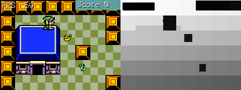

###Existing Depth Buffer
The graphics frameworks is already using buffers under the hood. When you call ```GraphicsManager.Instance.ClearScreen(System.Drawing.Color.CadetBlue);``` in **Program.cs** the depth buffer is cleared to 0 (Pure white). 

Every sprite you draw renders as a quad. Each time you call ```GraphicsManager.Instance.Draw[String/Square/Line]``` or ```TextureManager.Instance.Draw```  0.005f is added to the depth, and the quad is rendered into the depth buffer with the new depth. The closer we get to 1, the darker the depth buffer.

The depth test passes, and the colors of the quad are drawn to screen.

Right now the depth test will always pass! This is becuase each time a new quad is rendered it is rendered with a z valu 0.005f higher than the last one. That is, nothing in the depth buffer will have a higher value (be darker) than the current thing being drawn.

Here is a screenshot of what our z buffer looks like. Notice how the tiles get darker not only going from top to bottom, but also left to right.



Just for fun, if you want to see the z-buffer for your self, you can add this code to **Game.cs**

```cs
if (InputManager.Instance.KeyPressed(OpenTK.Input.Key.Y)) {
    Image depthBuffer = GraphicsManager.Instance.GetDepthBuffer();
    depthBuffer.Save("depth_buffer.png", System.Drawing.Imaging.ImageFormat.Png);
}
```

With this code in place, every time you press the **Y** button the depth buffer will be saved next to the Asets directory and solution file.

###Explicit Depth Buffer