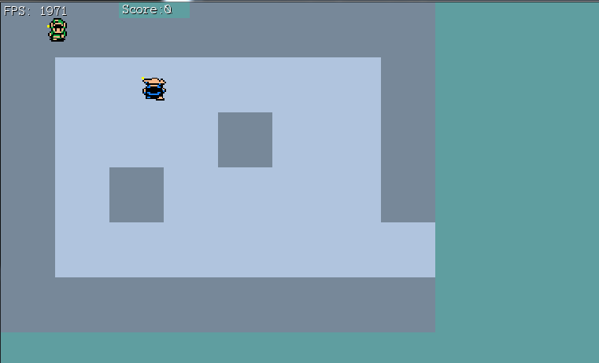
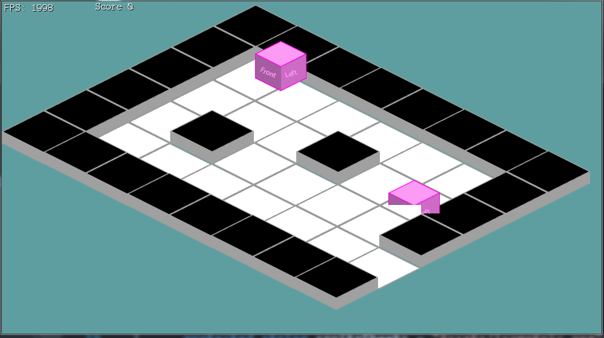

#Characters
Moving the characters into an isometric view might be a bit of a challenge. We're going to have to refactor far more code here than in the previous sections of the tutorial.

While doing all of this, keep in mind we are not doing collisions or any logic in an isometric space. Isometric is only a view, we still handle collisions and items in world space. 

Recall there are three important spaces: world space, camera space and screen space. Applying an isometric projection only changes the camera space. "Applying an isometric projection" might sound fancy, but reality, that's what the ```CartToIso``` in **Map.cs** does.

###Rendering World Space
Because we're doing all our logic in world space debugging will be a lot easyer if we can also see world space! If a collision looks wrong, it happens in an isometric view, but not in a top down view of world space then we know that the issue is render code and not collision code.

First, let's make a new variable in **Game.cs**. A public, static bool. Call it ```ViewWorldSpace``` and set it to false by default.

Update the ```Update``` function of **Game.cs**. Pick any key (I suggest 'U'), when that key is pressed toggle the ```ViewWorldSpace``` boolean.

In the ```Render``` function find where offsetPosition.X and Y are hard coded. Wrap that bit of code in an if statment, we only want to hard code the X and Y if ```ViewWorldSpace``` is **false**

Next, let's undo the isometric projection. In **Map.cs** find the  ```CartToIso``` and ```IsoToCart``` functions. If ```Game.ViewWorldSpace``` is true, return the arguments without any modification.

Last, we need to make a slight modification to the rendering code of **Tile.cs**. If ```Game.ViewWorldSpace``` is true, Draw a rectangle. The Location of the rectangle is going to be ```WorldPosition```, while it's size is going to be 69 x 70. (69 is 1/2 the width of each tile, 70 is the height of each tile). Thse are the numbers we set up in the constructor of **Map.cs** for the size and position of tiles. If ```Game.ViewWorldSpace``` is false, render everything as usual.

Further more, when ``````Game.ViewWorldSpace``` is true and we render a rectangle, if the tile is walkable render the rectangle in ```Color.LightSteelBlue```, otherwise render it in ```Color.LightSlateGray```.

**Run the game** and toggle the display. Your non-isometric world view should look like this:



###No more 30
Now that we can view world space just fine, we notice that the size of the world space tiles is MUCH larger than the size of our player and enemy tiles. Let's go ahead and fix this next.

The sizing issue happens because the map is rendering with our worlds current tile size, while the character an enemy have 30 hard coded for the tile size. That's no-bueno.

We have a global define in **Game.cs**, find the ```tileSize``` global variable and delete it. In it's place, add these two new defines:

```cs
public static readonly int TILE_W = 69; // 138 / 2
public static readonly int TILE_H = 70; // 70
```

We just caused a lot of compiler errors be removing ```tileSize```, go ahead and fix these. Instead of ```tileSize```, use ```TILE_W``` and ```TILE_H``` wherever appropriate. Appy H to Y values and W to X values.

Now it's time to replace EVERY OTHER INSTANCE of 30. Search the entire project _(Control + shift + F)_ for **30**, replace every instance with TILE_W or TILE_H, depending on which one is appropriate.

Update the constructor of **Map.cs** to use the constants from ```Game```, instead of hard coding 138 / 2 and 70.

In **Tile.cs** we hard coded the debug render size to 69x70. Switch these to be the constants in ```Game.cs```, also, there is a height text of 70 hard coded in there, change that 70 to ```Game.TILE_H```.

**Run the game**, if you switch into debug view, even tough link is the wrong size he can walk around the map. He just looks small. Confirm that collision and shooting work before moving on to the next section.

####Display the Character
Let's take a little bit of time to refactor **Character.cs**. The first thing i'm going to do is remove the code that renders the debug yellow square at the characters registration point.

Next, we're going to updat the character sprites. In **PlayerCharacter.cs** and in **EnemyCharacter.cs**, change the sprite sources to:

* AddSprite("Down", new Rectangle(52, 19, 85, 84)); 
* AddSprite("Up", new Rectangle(266, 19, 85, 84)); 
* AddSprite("Left", new Rectangle(155, 19, 85, 84)); 
* AddSprite("Right", new Rectangle(375, 19, 85, 84)); 

Back in **Character.cs**, let's go ahead and project these characters into an isometric space. In the ```Render``` method after the offset is applyed to ```renderPosition```, but before the y correction takes place go ahead and call ```Map.CartToIso```. 

```MapCartToIso``` will transform ```renderPosition``` from a cartesian space into an isometric space. Do this the same way you have already done it for **Tile.cs**

Lastly, back in **Game.cs**, go ahead and change ```heroSheet``` and ```npcSheet``` to point to the isometric sprite sheet. 

**Run the game**, the isometric view should look pretty close to correct. Moving around is going to be broken, but visually it's close to good. This is what your game should look like:

