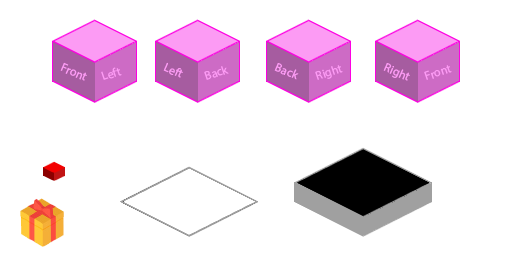

#Items and projectiles
Now that the player and enemy are both in isometric space, and 30 is no longer hard-coded anywhere in our code changing the items and the projectiles to be isometric as well is going to be super easy. You might even be able to do it without this guide.

First, we want to make sure that both projectiles and items work in our debug overhead view. Next, we update the sprites to use anisometric version. Finally, we apply the isometric projection with the helper function that lives in **Map.cs**. And that's pretty much it.

Here is the updates isometric.png sheet that has items and bullets on it:

###New projet?
You can either do this in a brand new project, or keep working int he lat isometric one. I'll leave it up to you.

###Making top-down work
Right now if you run the game and toggle on the debug view, your items are not visible, let's go ahead and fix that.