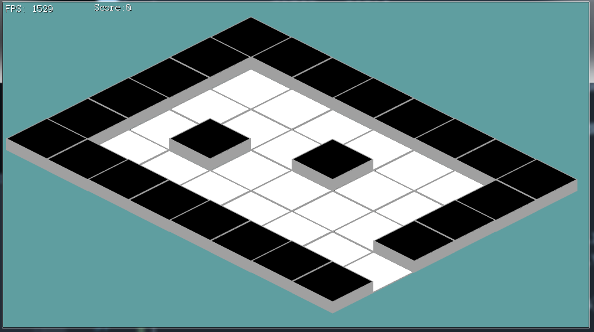

#Changine the map

###Game.cs
Let's start by refactoring the map to render in an isometric fasion! Let's start by editing **Game.cs**:

* Change the value of ```spriteSheets```
  * From: **"Assets/HouseTiles.png"**
  * To: **"Assets/isometric.png"**
* Change the value of ```spriteSources``` to
  * _/\*Index 0:\*/_ new Rectangle(120, 166, 138, 70),
  * _/\*Index 1:\*/_ new Rectangle(294, 147, 138, 90),
  * _/\*Index 2:\*/_ new Rectangle(120, 166, 138, 70)
* Change the value of ```room1Layout``` to
  * new int[] { 1, 1, 1, 1, 1, 1, 1, 1 },
  * new int[] { 1, 0, 0, 0, 0, 0, 0, 1 },
  * new int[] { 1, 0, 0, 0, 1, 0, 0, 1 },
  * new int[] { 1, 0, 1, 0, 0, 0, 0, 1 },
  * new int[] { 1, 0, 0, 0, 0, 0, 0, 2 },
  * new int[] { 1, 1, 1, 1, 1, 1, 1, 1 } 
* Change where room1 doctor is assigned:
  * From: ```room1[4][13].MakeDoor(room2, new Point(1, 1));```
  * To: ```room1[4][7].MakeDoor(room2, new Point(1, 1));```
* Change where room2 is assigned:
  * From: ```room2[1][0].MakeDoor(room1, new Point(12, 4));```  
  * To: ```room2[1][0].MakeDoor(room1, new Point(6, 4));```
* Hard code ```offsetPosition``` to **-150, 200** for now (We are not scrolling yet!)
* Make the client window size **990 x 550**

###Tile.cs
Next we have a minor change to make in **Tile.cs**, remember how we hard coded the visual tile height to 30? Well we need to undo it. Find where in the ```Render``` code wecompare to and subtract 30 to give the illusion of depth, now change that to 70.

While we are in **Tile.cs**, let's update the tiles visual render position! After the offset has been applyed to render pos, update the render position by calling Map.CartToIso on the render position and assigning the return of the function back into render position.

###Map.cs
There is one more place where we hard-coded 30 as the tile size that we have to fix. Let's go into **Map.cs**. Where the world position of each tile is being set, you need to change this:

* ```worldPosition.X = (int)(j * 30);```
* ```worldPosition.Y = (int)(i * 30);```

To This
* ```worldPosition.X = (int)(j * (138 / 2));```
* ```worldPosition.Y = (int)(i * (70));```

Why 138 / 2 and 70? Because the tiles are placed half the width and half width and half height apart. The width of the white base tile is 138, it's height is 70. Take a look at the image below, this is row 0:


**Run the game**, you should see your first isometric map be rendered:

