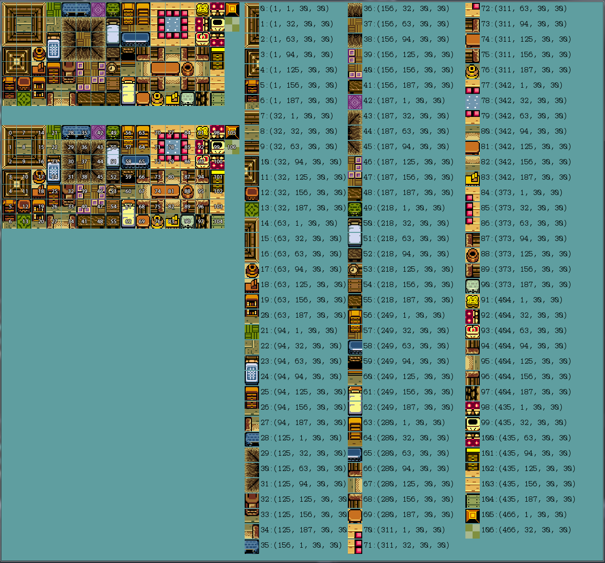
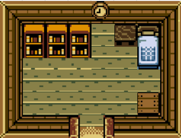

#On Your Own
Now that we've covered how to create and draw a tile based map, it's time for you to play around a bit on your own. This challenge is going to test your understanding of creating tile based maps. You will need to create a single room. Try your best to write all the code for this setion from scratch, only use the code from the last section if you get stuck.

###New Project
Create a new project, call it **TilePractice** and make the standard window appear. Don't forget to set your working directory correctly. Follow the instructions of this chapter in the new solution.

###Tile Object
Make yourself a tile object. This can be extremly similar to the tile object from the **CreatingTiles** section. You do not need to worry about things like scale or walkability. Your tile needs to keep track of:

* Sprite Instance
* Source Rectangle
* World Position

###Tile map
We are going to be re-using the **Assets/HouseTiles.png** sprite sheet for this project. It should already be in your shared Assets directory, assuming you set your working path correctly you shouldn't event need to add anything. Here is a position breakdown of each tile:

There are a lot of different ways to represent a tile map in memory, i strongly urge you to use the method we used in **CreatingTiles**. That is make a multidimensional array for the map layout, which indexes into two regular arrays for the sprite sheet names and sprite regions on the sheets.

###Goal
Given the above information try to recreate this room:

Make sure that your window is a tight fit to the room

###Extra Credit
This next part is optional, i suggest doing it as the extra practice tends to help.

Create another new solution, call it **TilePractice2**, repeat everything you just did, except instead of re-creating my room design design your own room using the sprite sheet. The room can be as big or as small as you want it to be.

##Checkin
Before moving onto the next section check in with me. I want to look over the code for both **CreatingTiles** and **TilePractice**