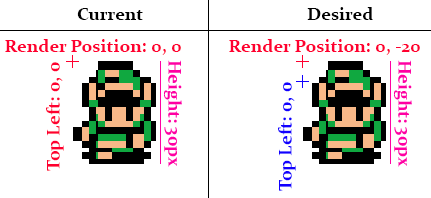

#Seperating Collision & Rendering
The first thing we need to do in order to add depth to our game is to seperate the collision rectangle of characters and tiles from their rendering. This will give us the unsorted illusion of depth. By the end of this chapter we want to achieve this effect (Note how links head is above the tile):

###New Project
Let's make a new project, call it **DepthBase** and get this project up to par with the **LimitedScrolling** section of the writeup. We're going to work from here.

###Character
We're going to start by changing the scrolling behaviour of the character class. Starting with the character is nice, we get the effects of it applied to both the player character and enemy character! We're only going to add depth on the Y axis for now, it's rare to see depth on the X axis.

We are going to hard code the height of the character to some number (In this example

