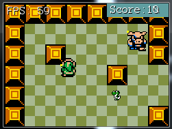

#Seperating Collision & Rendering
The first thing we need to do in order to add depth to our game is to seperate the collision rectangle of characters and tiles from their rendering. This will give us the unsorted illusion of depth. By the end of this chapter we want to achieve this effect (Note how links head is above the tile):


###New Project
Let's make a new project, call it **DepthBase** and get this project up to par with the **LimitedScrolling** section of the writeup. We're going to work from here.

##Character
We're going to start by changing the scrolling behaviour of the character class. Starting with the character is nice, we get the effects of it applied to both the player character and enemy character! We're only going to add depth on the Y axis for now, it's rare to see depth on the X axis.

We are going to hard code the height of the character to some constant number (In this example 20px). Whenever the corners or bounding rectangle of the character is requested we're going to change the return to have 20 hard coded to it. Then we're going to change the render function, we're going to change it to render the sprite at Position.Y - 20 instead of Position.Y.

These changes will cause a 20px gap at the top of our characters. This part of the sprite will still be drawn, but it won't be taken into collision calculations. I made a graphic atempting to describe what we will be doing:


###Debug Rendering
Before we start coding anything, let's make our lives easyer by adding a little debug indicator to the ```Character``` class. At the end of the **Render** function, add this bit of code:

```
// Get a 3x3 rectangle, centered on the top left pixel
Rectangle positionLocator = new Rectangle((int)Position.X - 1, (int)Position.Y - 1, 3, 3);
// Apply camera offset
positionLocator.X -= (int)offsetPosition.X;
positionLocator.Y -= (int)offsetPosition.Y;
// Draw indicator
GraphicsManager.Instance.DrawRect(positionLocator, Color.Yellow);
```

This should draw a 3x3 yellow rectangle centered at the top left pixel of the character. If you run your game you should see this:


###Applying Depth
First, we have to add a new member variable to the ```Character``` class. Make it a protected **float** and call it ```Height```. Set it to **-1** by default. If the new variable is less than 0 we will not apply the depth effect to the character, if it is greater than 0 we will apply a depth effect.

Next, change the constructor of character, it should now take in a third argument, a float called height. Set the member variable accordingly. Since we changed the constructor, we need to change where the constructor gets called. Find the following code in both ```PlayerCharacter``` and ```EnemyCharacter```:

```cs
: base(spritePath, pos) {
```

In ```PlayerCharacter``` pass **20** as the third argument, in ```EnemyCharacter``` pass **-1** as the third argument. By using constants as the last argument of the base constructor we can avoid changing the constructor of ```PlayerCharacter``` and ```EnemyCharacter```. Needless to say, the player will have a depth effect, while the enemy will not.

Change the **Rect** getter in the ```Character``` class. If the new ```Height``` variable is >= 0, set the returned rectangles height to the varaible.

Change the **Corners** getter. Right now it uses this bit of code to add height to corners ```SpriteSources[currentSprite][currentFrame].Height```, if the new ```Height``` variable is >= 0, use the ```Height``` variable, if it's less than 0 keep using what was already there.

Finally, change the **Render** function. After subtracting ```offsetPosition``` from ```renderPosition```, if the new ```Height``` variable is >= 0 find the height difference of the frame height and the hard coded height:

```cs
int difference = SpriteSources[currentSprite][currentFrame].Height - (int)Height;
```

and subtract it from from ```renderPosition.Y```. That should do it. **Run the game** and you should be able to walk up to walls and overlap them a bit. Links head should be above the yellow debug indicator. our game should look like this:



Notice how the moblins yellow indicator pixel is at his top left, while link's is slightly below his head. Also, links head slightly overlaps the obstacle. This is what we expected.

##Tiles
The character having depth is awesome, but we're going to want the tiles to have depth too! Unlike character however we always know the height of a tile, it's 30! Because we already know the height of the tile, all we need to change is the ```Render``` function in **Tile.cs**.

This is what the current tile render function looks like (I've added comments to help readability):

```cs
public void Render(PointF offsetPosition) {
    // Find the world render position of this tile
    Point renderPos = new Point(WorldPosition.X, WorldPosition.Y);
    // Apply scale to tile offset
    renderPos.X = (int)(Scale * renderPos.X);
    renderPos.Y = (int)(Scale * renderPos.Y);
    // Move the tile into camera space
    renderPos.X -= (int)offsetPosition.X;
    renderPos.Y -= (int)offsetPosition.Y;
    // Draw the tile
    TextureManager.Instance.Draw(Sprite, renderPos, Scale, Source);
}
```

After moving the tile into camera space, make a new rectangle, call it renderRect and copy Source into is, then use this new renderRect to draw instead of Source (Change last argument). You can copy one rect into another with only two arguments like so:

```cs
Rectangle renderRect = new Rectangle(Source.Location, Source.Size);
```

After creating renderRect, check it's height. If renderRect.Height **is not equal to** 30 we will want to offset the tile render position. 

To offset the render position, first find the ```heightDifference``` by subtracting 30 from renderRect.Height, i suggest storing this in a variable. Then, subtract ```heightDifference``` from ```renderRect.Y```.

That's it! Tiles now have the same depth support that the character does. We will not be able to test this right now for two resons. First, we don't have any tiles that are taler than 30 pixels. 

Second, because we draw all the tiles first, then the character on top, we would never see the character behind a tile. We're going to fix this in the next section.