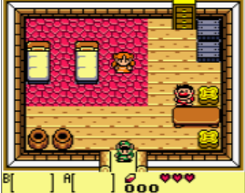
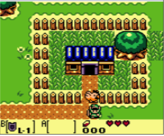
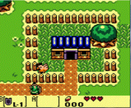
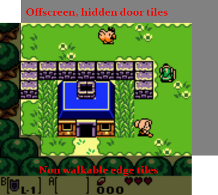

#Screen Borders
The door section was a bit more intense than originally expected. Luckly for you, this section of the tutorial has no code for you to write. I just wanted to present you with an alternate way to use doors. There are of course many more ways to use them, not just the one we have already seen and the one we're about to see. I encourage you to think about and play with door mechanics.

The legend of zelda actually uses two different types of doors. Real doors and hidden doors. A real door looks like this:

Notice how link is standing right in the doorway. If he moves just one more pixel down he will leave the house. This is similar to how we handled door interaction.

In outdoor environments however, hidden doors are used. Take a look at this picture:

Link is just standing on the edge of the screen. If that was a door tile, the entire screen would already be transitioning. Instead, link has to walk down one more tile to trigger the screen transition. Here that is in action:

So how is this done? The simple answer is that there are door tiles outside of the render area! When link walks off-screen instead of the game breaking because there not being any more tiles to check for collision against, there are hidden tiles off-screen. These tiles are collided with, colliding with a door tile causes a screen trnasition. 

Here is an example of what the hidden tiles _might_ look like:

The legend of zelda is unique in that the world doesn't scroll. At the edge of every screen is a hidden door or 7. Other games, like Final Fantasy do scroll with the player. They don't need any hidden doors. We will discuss how to scroll the world with the player later.