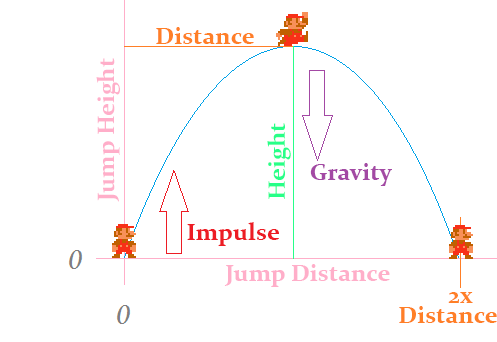

#Configure the jump
The ability to jump is great! But right now it feels a bit off. Jumping is controlled by two variables, gravity and impulse. If we want to change the jump behaviour we have to change these two numbers. Here is the thing tough, i'm an engineer and i don't know what the gravity needs to be to jump 3 tiles high in half a second.

[When you design a jump](http://www.atomjack.net/blog/2014/12/9/dev-blog-designing-a-jump) having gravity and impulse is not intuitive. You usually want to design a jump around two other values, **Height** and **Duration**. Saying i want to jump 3 tiles tall in 0.25 seconds is super intuitive, and makes creating [Different jump behaviours](http://excitemike.com/JumpingControlTester) a lot easyer. 

So, can we actually do this? Come up with a way to specify height and duration instead of gravity and velocity? Yes, yes we can. With math. Complicated math. Hard math. Confusing math. Man math! What follows might be confusing or hard. I didn't come up with it. This is math i can't actually derive, i had to look up the formulas. I'll link where i found those formulas at the end of the chapter.

###The jumping system



In the above picture there are four forces controlling the jump:

* **height**: The maximum peak height of our jump in world units
* **duration**: The duration from when we jump until we reach the peak in seconds
* **impulse**: Our initial upward velocity when we jump in units per second
* **gravity**: Our acceleration due to gravity pulling us back down in units per second squared

Only impulse and gravity is needed to **define the jump**, height and duration actually **describe the jump**. We already have the jump definition in our code, all we need is to figure out a way to convert the jump description into a definition. Lickly given any two of these four items, we can find the other two.

###Jumping conversions

Given a height and duration:
* **impulse** = 2 * height / duration
* **gravity** = negative impulse / duration

Using the above formulas, add this method to the **Player Character** class, and fill in the blanks:

```cs
public void SetJump(float height, float duration) {
    impulse = // TODO
    impulse *= -1; // Remember, in our implementation model, impulse starts off negative!
    gravity = // TODO
}
```


The above are the only conversions we care about, but for the sake of fullness, here are ALL of the conversions:
* **height** = impulse * duration / 2
* **impulse** = 2 * height / duration
* **duration** = 2 * height / impulse
* **impulse** = negative gravity * duration
* **duration** = negative impulse / gravity
* **gravity** = negative impulse / duration

###Configuring the jump
In the **PlayerCharacter.cs** ```Initialize``` function, after you've added all the sprites call the new ```SetJump``` function. Just for fun you can add a console log to the SetJump function to see what the impulse and gravity you are setting are eventually going to be.

Play around wih the numbers for a bit to see it working. Remember, height is in world pixels. This means if you want to jump 3 tiles height will need to be 3 * 30. Also, duration is in seconds. If you set either number too high the game is going to crash, this is because link will simply tunnel trough the obstacles, into the void.

Now that you've played around with the values, here are the defaults we will be using for the rest of the book:

* **height**: 3.0f * 3.0f // 3 tiles
* **duration**: 0.75f // three fourths of a second

###Check in
Before moving onto the next section (Clouds) i want you to check in with me, we did some pretty complicated code for jumping and i want to make sure that there are no errors in your code at this point.

#Formula origins
Like i said, i don't know the formulas for height / impulse / gravity / duration conversion by heart. What's worse, i'm not good enough at math to derive them! This is actually something pretty common in games, we need complicated math but can't always derive said math. Luckly other people have done so for us. A little google goes a long way.

All of the formulas i've used on this page have come from [this article](http://www.piratehearts.com/blog/2012/11/30/deriving-the-mathematics-of-jumping-physics-part-1-of/). While researching i also found [another promising article](http://error454.com/2013/10/23/platformer-physics-101-and-the-3-fundamental-equations-of-platformers/), but the first one had the exact formulas i needed so i never read the second one. You should read trough those articles. They might make more sense to you than they did to me.